# Code Structure Documentation

This document provides a detailed technical analysis of the MCP-Server-Template codebase, focusing on component relationships, implementation details, and architectural decisions.

## 📚 Related Documentation

<table>
  <tr>
    <td align="center"><b><a href="README.md">🏠 Main README</a></b></td>
    <td>Technical documentation with setup instructions and configuration details</td>
  </tr>
  <tr>
    <td align="center"><b><a href="OVERVIEW.md">📐 Architecture Overview</a></b></td>
    <td>High-level architecture and conceptual overview</td>
  </tr>
  <tr>
    <td align="center"><b><a href="MCP_API.md">🔌 API Reference</a></b></td>
    <td>Detailed API endpoint specifications and JSON-RPC methods</td>
  </tr>
</table>

## 📁 Project Structure Overview

<div align="center">

```mermaid
graph TD
    classDef configFiles fill:#f9d6ff,stroke:#333,stroke-width:1px
    classDef sourceFiles fill:#d6e7ff,stroke:#333,stroke-width:1px
    classDef buildFiles fill:#d6fff9,stroke:#333,stroke-width:1px
    classDef serviceFiles fill:#fff9d6,stroke:#333,stroke-width:1px
    
    Root[Project Root]
    Config[mcp-config/]:::configFiles
    MCP[mcp-service/]:::sourceFiles
    
    Root --> Config
    Root --> MCP
    Root --> DocFiles[Documentation Files]
    Root --> DockerCompose[docker-compose.yml]:::buildFiles
    
    Config --> ConfigEnv[.env]:::configFiles
    Config --> ConfigTools[tools.json]:::configFiles
    Config --> Services[services/]:::serviceFiles
    Services --> CrawlService[CrawlService.ts]:::serviceFiles
    Services --> DynamicServices["Additional Services (Dynamically Loaded)"]:::serviceFiles
    
    MCP --> SourceFiles[src/]:::sourceFiles
    MCP --> BuildConfig[tsconfig files]:::buildFiles
    MCP --> Dockerfile[Dockerfile]:::buildFiles
    MCP --> PackageJSON[package.json]:::buildFiles
    
    SourceFiles --> IndexTS[index.ts]:::sourceFiles
    SourceFiles --> CoreDir[@core/]:::sourceFiles
    
    CoreDir --> ConfigDir[config/]:::configFiles
    CoreDir --> MCPDir[mcp/]:::sourceFiles
    CoreDir --> RoutesDir[routes/]:::sourceFiles
    CoreDir --> ServerDir[server/]:::sourceFiles
    CoreDir --> UtilsDir[utils/]:::sourceFiles
    CoreDir --> TypesDir[types/]:::sourceFiles
    
    click IndexTS "/#entry-point-srcindexts"
    click ConfigDir "/#configuration-srccoreconfigts"
    click MCPDir "/#mcp-protocol-srccoremcpcoremcpserverts"
    click RoutesDir "/#routes-srccoreroutests"
    click ServerDir "/#server-srccoreserverserverts"
    click ServicesDir "/#services-mcp-configservices"
    click UtilsDir "/#utilities-srccoreutilsts"
    click TypesDir "/#types-srctypests"
```

</div>

## 🔍 Component Dependency Graph

<div align="center">

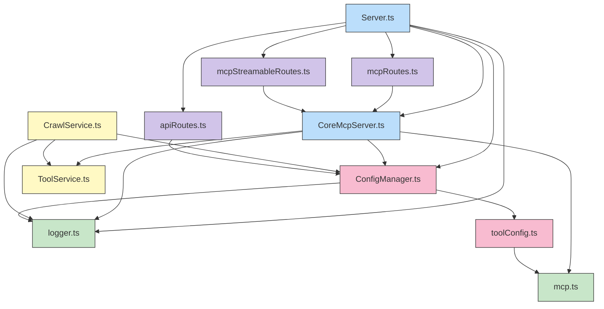

</div>

## 📝 Detailed Component Analysis

### Entry Point: src/index.ts

The entry point file bootstraps the application and handles the lifecycle:

```typescript
// Simplified version of what happens in index.ts
import { Server } from './@core/server/Server.js';

async function bootstrap() {
  // Initialize configuration
  await configManager.init(['./mcp-config/tools.json']);
  
  // Create and initialize the server
  const server = new Server();
  await server.init();
  
  // Start the server
  const port = configManager.get('port', 3000);
  server.start(port);
  
  // Setup graceful shutdown
  setupShutdownHandlers(server);
}

// Start the application
bootstrap().catch(error => {
  console.error('Failed to start server:', error);
  process.exit(1);
});
```

**Key responsibilities:**
- Application bootstrapping
- Configuration initialization
- Server instantiation and startup
- Graceful shutdown handling
- Global error handling

### Configuration: src/@core/config/

<div align="center">

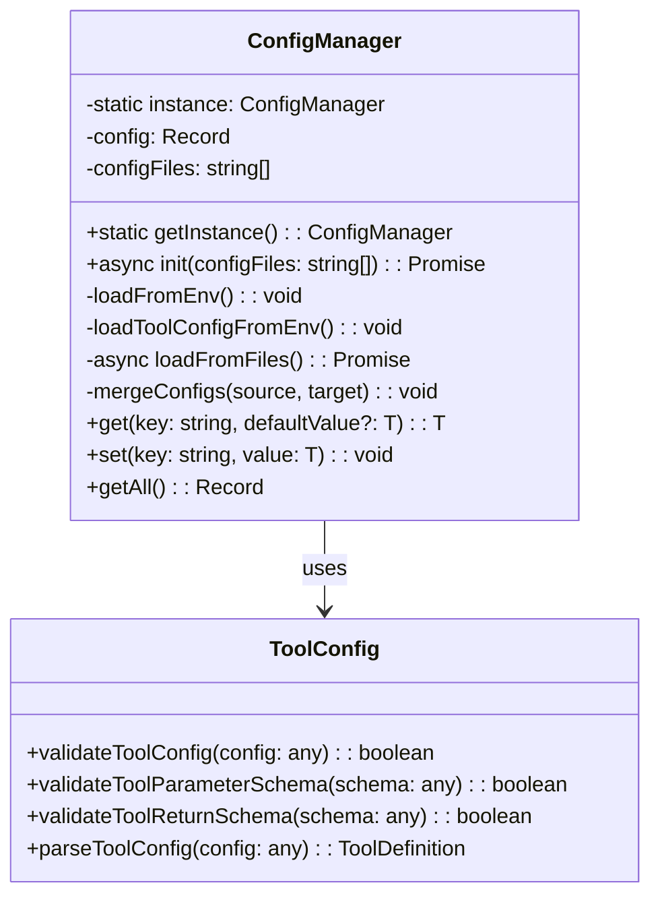

</div>

#### configManager.ts

A singleton class that manages configuration from multiple sources with priority:

1. **Environment variables** (highest priority)
2. **Configuration files** (medium priority)
3. **Code defaults** (lowest priority)

It implements:
- Lazy loading of configuration files (JSON/JS)
- Environment variable parsing with type conversion
- Dot notation for hierarchical config access
- Deep merging of configuration objects

**Usage example:**
```typescript
// Get a config value with fallback
const port = configManager.get('port', 3000);

// Set a config value
configManager.set('debug.enabled', true);

// Access nested configuration
const corsOrigins = configManager.get('cors.origins', ['*']);
```

#### toolConfig.ts

Handles tool-specific configuration validation and parsing:

- JSON Schema validation for tool parameters
- Conversion between configuration formats
- Default values for tool properties

### MCP Protocol: src/@core/mcp/CoreMcpServer.ts

<div align="center">

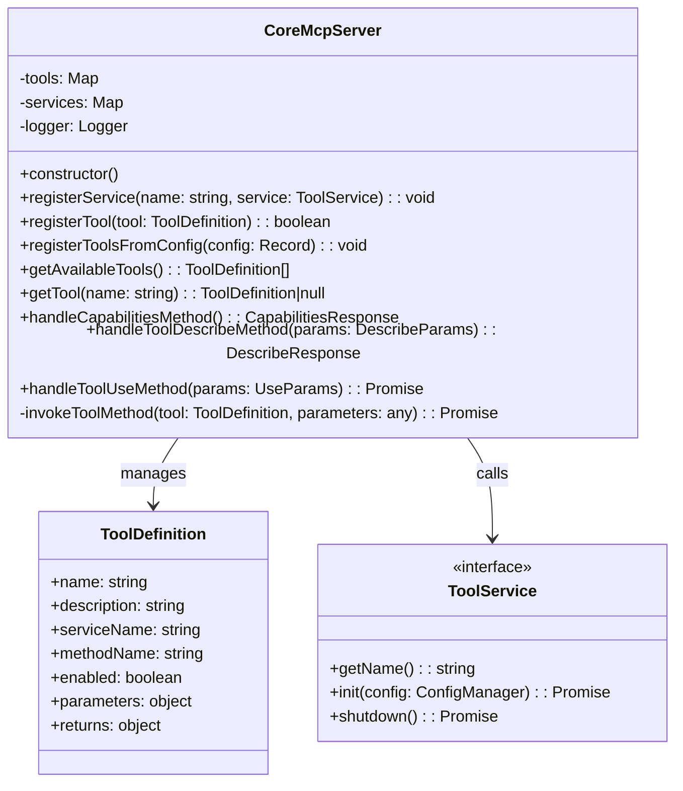

</div>

The core implementation of the Model Context Protocol:

- **Tool Registration**: Manages tool definitions and their mapping to services
- **Service Registration**: Tracks available services for tool execution
- **Method Handling**: Implements the three MCP methods:
  - `mcp.capabilities`: Returns server metadata and available tools
  - `mcp.tool.describe`: Returns detailed information about a specific tool
  - `mcp.tool.use`: Executes a tool with provided parameters

**Key implementation details:**
- Tool validation using JSON Schema
- Service method resolution and invocation
- Error handling and standardized error responses
- Streaming results support

### Routes: src/@core/routes/

<div align="center">

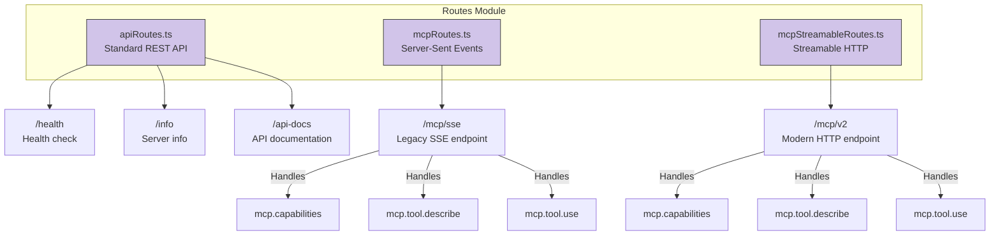

</div>

#### apiRoutes.ts

Defines standard REST API endpoints:

- **GET /health**: Server health check endpoint
- **GET /info**: Server information and version
- **GET /api-docs**: API documentation reference

Implementation details:
- Clean Express routing patterns
- Consistent response formatting
- Proper status codes and headers

#### mcpRoutes.ts

Implements the legacy Server-Sent Events (SSE) transport for MCP:

- **POST /mcp/sse**: Accepts JSON-RPC requests and responds with SSE
- Event-based streaming for long-running operations

Implementation details:
- SSE connection management
- Proper content-type headers (`text/event-stream`)
- Heartbeat mechanisms to keep connections alive

#### mcpStreamableRoutes.ts

Implements the modern HTTP streaming transport for MCP:

- **POST /mcp/v2**: Accepts JSON-RPC requests and responds with streamed HTTP
- Better compatibility with standard HTTP infrastructure

Implementation details:
- Chunked transfer encoding
- Response streaming with `res.write()`
- Buffer flushing for immediate delivery

### Server: src/@core/server/Server.ts

<div align="center">

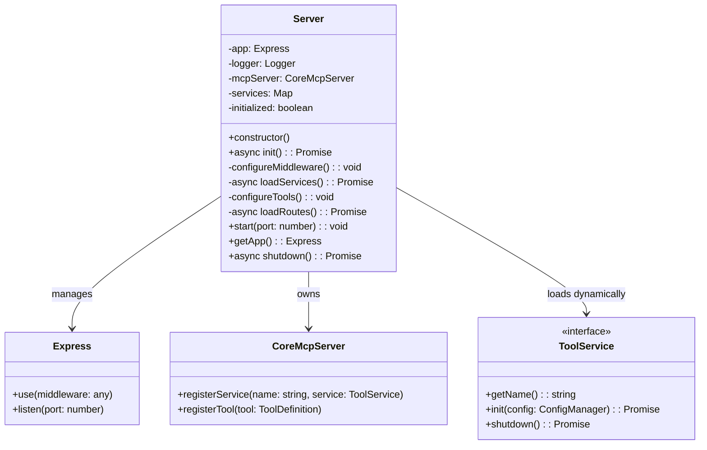

</div>

The central class that ties everything together:

- **Express Integration**: Configures and manages the Express application
- **Middleware Configuration**: Sets up CORS, JSON parsing, security headers, etc.
- **Dynamic Service Management**: Automatically discovers and loads service implementations from the `mcp-config/services/` directory
- **Tool Configuration**: Registers tools from configuration or defaults
- **Route Setup**: Loads and mounts route handlers

**Key implementation details:**
- Proper asynchronous initialization
- Service lifecycle management (init, shutdown)
- Error boundary handling
- Clean separation of concerns
- Dynamic service discovery and loading using a file system scanner

The `loadServices()` method is responsible for discovering and loading all service implementations:

```typescript
private async loadServices(): Promise<void> {
  this.logger.info('Loading services...');
  const servicesDir = path.resolve('./mcp-config/services');
  
  try {
    // Get all TypeScript and JavaScript files in the services directory
    const files = fs.readdirSync(servicesDir)
      .filter(file => file.endsWith('.ts') || file.endsWith('.js'));
    
    // Load each service dynamically
    for (const file of files) {
      try {
        const filePath = path.join(servicesDir, file);
        // Use dynamic import to load the service
        const serviceModule = await import(filePath);
        
        // Get the default export which should be the service class
        const ServiceClass = serviceModule.default;
        if (!ServiceClass || typeof ServiceClass !== 'function') {
          this.logger.warn(`Service file ${file} does not export a class as default`);
          continue;
        }
        
        // Instantiate the service
        const service = new ServiceClass();
        if (!service || typeof service.getName !== 'function') {
          this.logger.warn(`Service in ${file} does not implement ToolService interface`);
          continue;
        }
        
        const name = service.getName();
        this.services.set(name, service);
        
        // Initialize the service
        await service.init(configManager);
        
        // Register the service with the MCP server
        this.mcpServer.registerService(name, service);
        this.logger.info(`Service '${name}' loaded and registered`);
      } catch (err) {
        this.logger.error(`Failed to load service from ${file}:`, err);
      }
    }
  } catch (err) {
    this.logger.error('Error loading services:', err);
  }
}
```

### Services: mcp-config/services/

<div align="center">

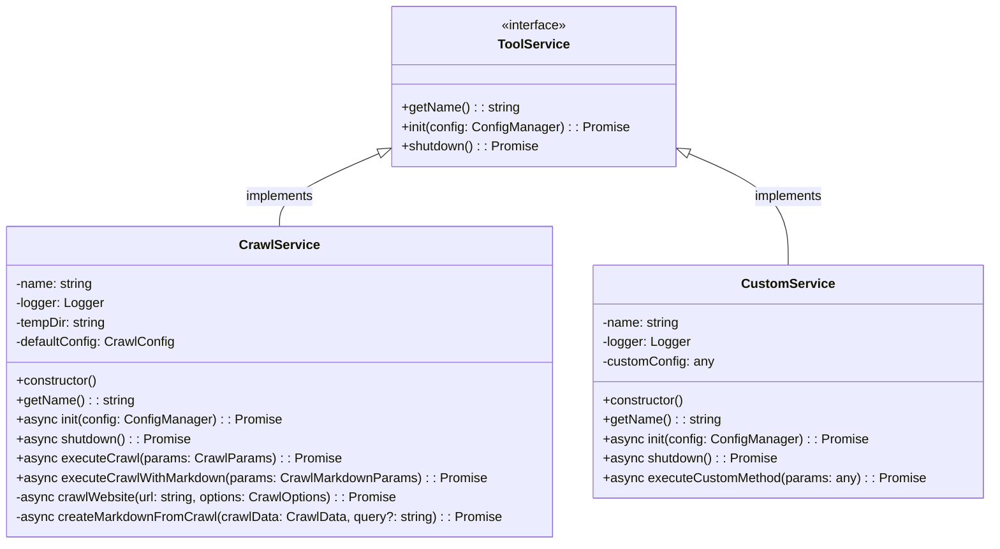

</div>

The services directory contains implementations of the `ToolService` interface. The server now dynamically loads all TypeScript (.ts) or JavaScript (.js) files in this directory, automatically registering any class that implements the `ToolService` interface.

**Key benefits of dynamic service loading:**
- **Plug-and-Play Extensibility**: Add new service files to the directory and they're automatically discovered
- **Runtime Configuration**: No need to modify server code when adding new services
- **Isolation**: Each service operates independently with its own lifecycle and configuration
- **Testability**: Services can be tested in isolation without server dependencies

To create a new service:
1. Create a new file in `mcp-config/services/` (e.g., `MyNewService.ts`)
2. Implement the `ToolService` interface
3. Export the class as default
4. Define corresponding tool configurations in `tools.json`

**Example of a minimal service implementation:**
```typescript
import { ToolService } from '../../mcp-service/src/@core/services/ToolService';
import { ConfigManager } from '../../mcp-service/src/@core/config/configManager';
import { createLogger } from '../../mcp-service/src/@core/utils/logger';

export default class MyNewService implements ToolService {
  private name = 'my-new-service';
  private logger = createLogger('MyNewService');
  
  getName(): string {
    return this.name;
  }
  
  async init(config: ConfigManager): Promise<void> {
    this.logger.info('Initializing MyNewService');
    // Setup logic here
  }
  
  async shutdown(): Promise<void> {
    this.logger.info('Shutting down MyNewService');
    // Cleanup logic here
  }
  
  async executeCustomAction(params: any): Promise<any> {
    // Implementation here
    return { result: 'Success' };
  }
}
```

### 🔌 Dynamic Service Architecture

The server implements a dynamic service loading system that automatically discovers and integrates service implementations at runtime without requiring code changes to the core server.

<div align="center">

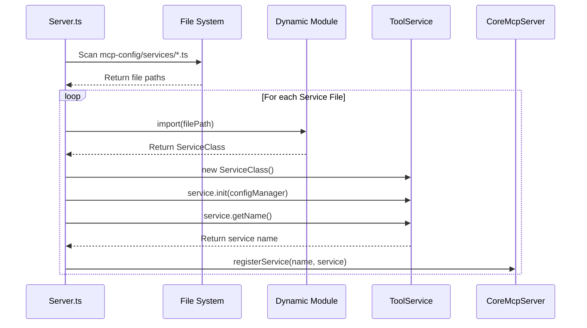

</div>

### Key Benefits

1. **Zero-Configuration Integration**: Add new service files to the `mcp-config/services/` directory and they're automatically discovered and loaded
2. **Hot-Swap Capability**: Update service implementations without changing core server code
3. **Isolated Development**: Services can be developed, tested, and deployed independently
4. **Decoupled Architecture**: Each service has its own lifecycle, configuration, and dependencies
5. **Simplified Extension**: No need to modify core server logic when adding new functionality

### How to Add a New Service

1. **Create a service file** in the `mcp-config/services/` directory:

```typescript
// mcp-config/services/ExampleService.ts
import { ToolService } from '../../mcp-service/src/@core/services/ToolService';
import { ConfigManager } from '../../mcp-service/src/@core/config/configManager';
import { createLogger } from '../../mcp-service/src/@core/utils/logger';

export default class ExampleService implements ToolService {
  private name = 'example-service';
  private logger = createLogger('ExampleService');
  
  getName(): string {
    return this.name;
  }
  
  async init(config: ConfigManager): Promise<void> {
    this.logger.info('Example service initializing');
    // Initialization logic here
  }
  
  async shutdown(): Promise<void> {
    this.logger.info('Example service shutting down');
    // Cleanup logic here
  }
  
  // Tool method example
  async generateExample(params: { prompt: string }): Promise<{ result: string }> {
    this.logger.info(`Generating example with prompt: ${params.prompt}`);
    return { result: `Example generated from: ${params.prompt}` };
  }
}
```

2. **Define tool configurations** in `mcp-config/tools.json`:

```json
{
  "tools": {
    "example-generator": {
      "name": "example-generator",
      "description": "Generates example responses from text prompts",
      "serviceName": "example-service",
      "methodName": "generateExample",
      "enabled": true,
      "parameters": {
        "type": "object",
        "properties": {
          "prompt": {
            "type": "string",
            "description": "The input text to generate from"
          }
        },
        "required": ["prompt"]
      },
      "returns": {
        "type": "object",
        "properties": {
          "result": {
            "type": "string",
            "description": "The generated example"
          }
        }
      }
    }
  }
}
```

3. **Restart the server** to automatically load the new service

The server's `loadServices()` method will:
- Scan for all `.ts` and `.js` files in the services directory
- Dynamically import each file using ES modules
- Check if it exports a class that implements the `ToolService` interface
- Instantiate the service and initialize it with the config manager
- Register the service with the MCP server for tool execution

### Debugging Service Loading

If a service fails to load, check the server logs for detailed error messages. Common issues include:

- Service not exported as default export
- Service not implementing the ToolService interface correctly
- Initialization errors in the service's init() method
- Tool definitions in tools.json not matching service methods

### Utilities: src/@core/utils/

#### logger.ts

A wrapper around the Winston logging library:

- Consistent log formatting across the application
- Log levels controlled by configuration
- Service/component tagging for easier debugging
- File and console logging support
- Log rotation and management

**Usage example:**
```typescript
const logger = createLogger('ComponentName');

logger.debug('Debug message with object', { key: 'value' });
logger.info('Informational message');
logger.warn('Warning message');
logger.error('Error message', error);
```

### Types: src/@core/types/

<div align="center">

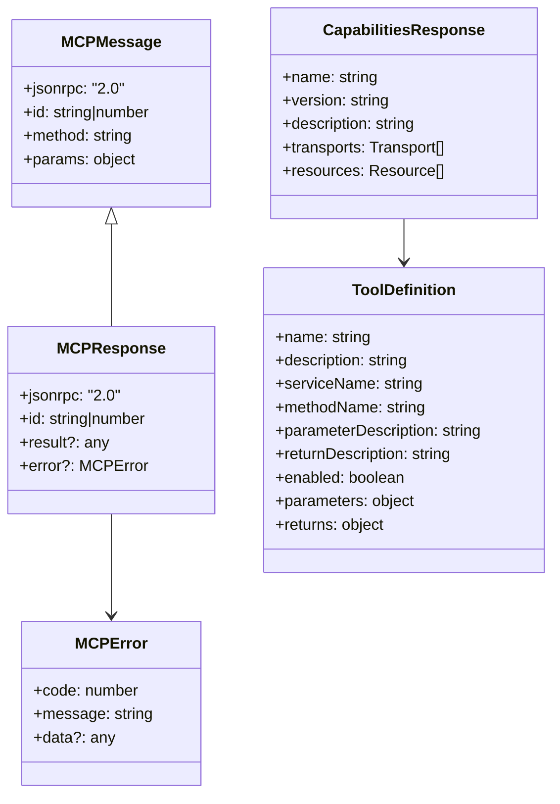

</div>

#### mcp.ts

Contains TypeScript interfaces for MCP protocol messages:

- Request and response types
- Tool definition structures
- Error codes and messages
- Parameter validation schemas

**Key types:**
- **CapabilitiesRequest/Response**: For the discovery method
- **DescribeRequest/Response**: For the tool description method
- **UseRequest/Response**: For tool execution

#### modelcontextprotocol.d.ts

Type declarations for the MCP SDK:

- Protocol constants
- Transport interfaces
- Streaming utilities

## 🔄 Request-Response Flow Sequence

<div align="center">

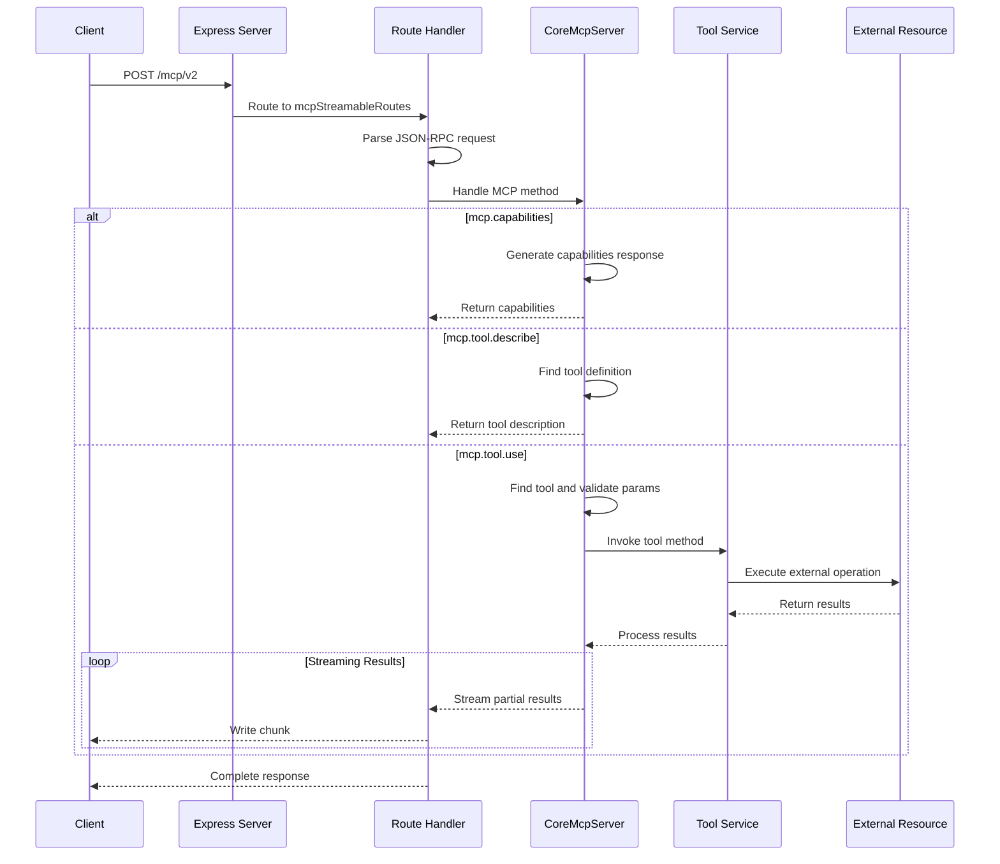

</div>

## 📦 Module Dependency Tree

<div align="center">

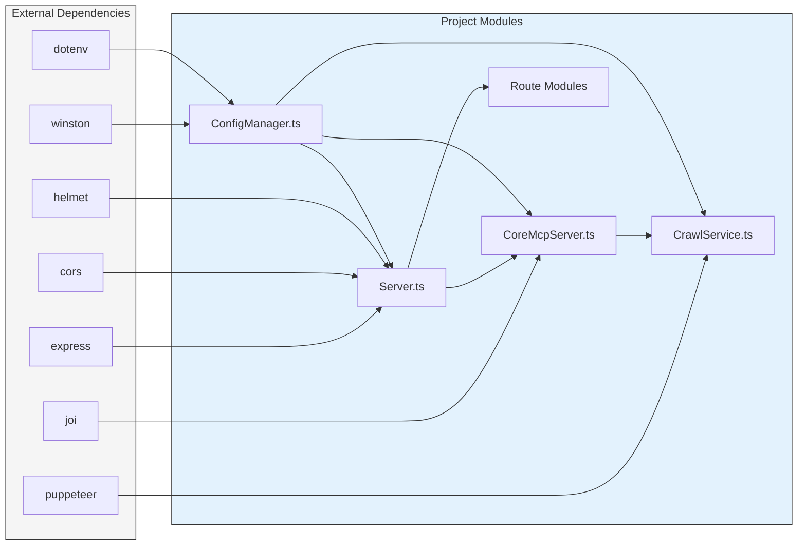

</div>

## 🧪 Testing Structure

The test suite mirrors the source code structure:

<div align="center">

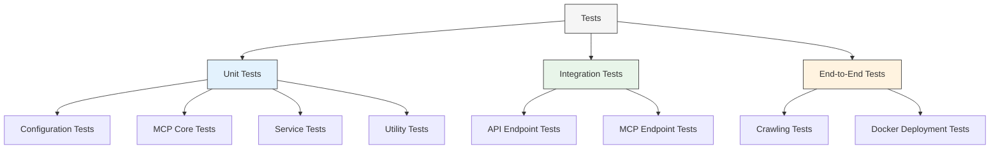

</div>

## 🧠 Design Patterns Used

1. **Singleton Pattern**: Used in the ConfigManager to ensure a single instance of configuration
2. **Factory Pattern**: Logger creation and service initialization
3. **Strategy Pattern**: Different crawling strategies in the CrawlService
4. **Facade Pattern**: Server class provides a unified interface to complex subsystems
5. **Dependency Injection**: Services are injected into the MCP server
6. **Interface Segregation**: ToolService interface defines minimal requirements
7. **Repository Pattern**: Tool and service registries in CoreMcpServer

## 📈 Performance Considerations

1. **Asynchronous Operations**: All I/O operations are non-blocking
2. **Connection Pooling**: Database and HTTP connections are pooled
3. **Streaming Responses**: Results are streamed to avoid memory issues
4. **Resource Cleanup**: Temporary resources are properly disposed
5. **Error Boundaries**: Errors are contained and don't crash the server

## 🔒 Security Implementations

1. **Helmet Integration**: Sets security headers to prevent common attacks
2. **Input Validation**: All input parameters are validated with schemas
3. **Rate Limiting**: Configurable rate limiting prevents abuse
4. **CORS Configuration**: Restrictive CORS policy by default
5. **Error Sanitization**: Error responses don't expose sensitive information

## 🚀 Extensibility Points

1. **Adding New Tools**: 
   - Create a new service implementation
   - Register in Server.loadServices()
   - Add tool definition to tools.json

2. **Adding New Endpoints**:
   - Create a new route module
   - Register in Server.loadRoutes()

3. **Adding Middleware**:
   - Extend Server.configureMiddleware()

4. **Custom Logging**:
   - Extend logger.ts with additional transports
