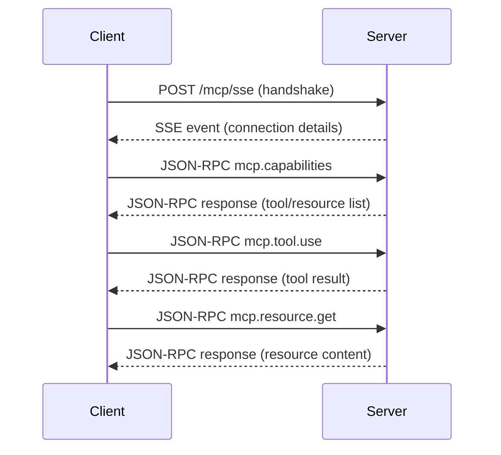

# Model Context Protocol (MCP) API Reference

This document provides detailed specifications for the MCP server endpoints, JSON-RPC methods, request/response schemas, and examples.

---

## Additional Documentation

- **[README.md](README.md)**: Technical documentation with setup instructions and configuration details.
- **[CODE_STRUCTURE.md](CODE_STRUCTURE.md)**: Detailed explanation of each source file and its purpose.
- **[OVERVIEW.md](OVERVIEW.md)**: High-level architecture and conceptual overview.

## 1. SSE Endpoint: `/mcp/sse`

- Method: `POST`
- Description: Establishes a Server-Sent Events (SSE) connection for bi-directional JSON-RPC messaging.

### 1.1 Connection Initialization

**Request** (empty body or initial handshake):

```http
POST /mcp/sse HTTP/1.1
Host: <server>
Content-Type: application/json
Accept: text/event-stream

{ }
```

#### Request Schema

```json
{
  "type": "object",
  "properties": {},
  "additionalProperties": false
}
```

**Response** (SSE stream):
```
data: {"jsonrpc":"2.0","result":{"mcp":{
  "name":"<serverName>",
  "version":"<version>",
  "description":"<description>"
}},"id":null}

```

#### SSE Event Format (JSON-RPC 2.0)

```json
{
  "type": "object",
  "properties": {
    "jsonrpc": { "const": "2.0" },
    "result": {
      "type": "object",
      "properties": {
        "mcp": {
          "type": "object",
          "properties": {
            "name": { "type": "string" },
            "version": { "type": "string" },
            "description": { "type": "string" }
          },
          "required": ["name", "version"]
        }
      },
      "required": ["mcp"]
    },
    "id": { "type": ["string", "number", "null"] }
  },
  "required": ["jsonrpc", "result", "id"]
}
```

- Each line prefixed with `data:` is a JSON-RPC message event.

---

## 2. JSON-RPC Methods

All subsequent requests and responses use JSON-RPC 2.0 protocol over the SSE connection.  

### 2.1 mcp.capabilities

Retrieve lists of available tools and resources.

**Request**:
```json
{
  "jsonrpc": "2.0",
  "method": "mcp.capabilities",
  "params": {},
  "id": 1
}
```

#### Params Schema

```json
{
  "type": "object",
  "properties": {},
  "additionalProperties": false
}
```

**Response**:
```json
{
  "jsonrpc": "2.0",
  "result": {
    "tools": [
      { "name": "crawl", "description": "Crawl a website...", "parameterDescription": {...}, "returnDescription": {...} }
      // ...
    ],
    "resources": [
      { "name": "info", "uri": "info://about" }
      // ...
    ]
  },
  "id": 1
}
```

#### Result Schema

```json
{
  "type": "object",
  "properties": {
    "tools": {
      "type": "array",
      "items": {
        "type": "object",
        "properties": {
          "name": { "type": "string" },
          "description": { "type": "string" },
          "parameterDescription": { "type": "object" },
          "returnDescription": { "type": "object" }
        },
        "required": ["name", "description"]
      }
    },
    "resources": {
      "type": "array",
      "items": {
        "type": "object",
        "properties": {
          "name": { "type": "string" },
          "uri": { "type": "string" }
        },
        "required": ["name", "uri"]
      }
    }
  },
  "required": ["tools", "resources"]
}
```

Schema:
- `params`: `{}`  
- `result`: `{ tools: ToolInfo[], resources: ResourceInfo[] }`

---

### 2.2 mcp.tool.use

Invoke a registered tool by name.

**Request**:
```json
{
  "jsonrpc": "2.0",
  "method": "mcp.tool.use",
  "params": {
    "name": "crawl",
    "parameters": {
      "url": "https://example.com",
      "maxPages": 3,
      "depth": 2
    }
  },
  "id": 2
}
```

#### Params Schema

```json
{
  "type": "object",
  "properties": {
    "name": { "type": "string" },
    "parameters": {
      "type": "object",
      "properties": {
        "url": { "type": "string", "format": "uri" },
        "maxPages": { "type": "integer", "minimum": 1 },
        "depth": { "type": "integer", "minimum": 0 }
      },
      "required": ["url"]
    }
  },
  "required": ["name", "parameters"],
  "additionalProperties": false
}
```

**Response**:
```json
{
  "jsonrpc": "2.0",
  "result": {
    "success": true,
    "url": "https://example.com",
    "text": "<raw html or extracted text>",
    "tables": [ /* optional */ ]
  },
  "id": 2
}
```

#### Result Schema

```json
{
  "type": "object",
  "properties": {
    "success": { "type": "boolean" },
    "url": { "type": "string", "format": "uri" },
    "text": { "type": "string" },
    "tables": {
      "type": "array",
      "items": { "type": "object" }
    }
  },
  "required": ["success", "url", "text"]
}
```

Error Response (tool not found or validation error):
```json
{
  "jsonrpc": "2.0",
  "error": { "code": -32000, "message": "Error message" },
  "id": 2
}
```

Schema:
- `params`: `{ name: string; parameters: CrawlParams }`  
- `result`: `CrawlResponse`

---

### 2.3 mcp.resource.list

List URIs available for a given resource.

**Request**:
```json
{
  "jsonrpc": "2.0",
  "method": "mcp.resource.list",
  "params": { "name": "info" },
  "id": 3
}
```

#### Params Schema

```json
{
  "type": "object",
  "properties": {
    "name": { "type": "string" }
  },
  "required": ["name"],
  "additionalProperties": false
}
```

**Response**:
```json
{
  "jsonrpc": "2.0",
  "result": { "uris": ["info://about"] },
  "id": 3
}
```

#### Result Schema

```json
{
  "type": "object",
  "properties": {
    "uris": {
      "type": "array",
      "items": { "type": "string" }
    }
  },
  "required": ["uris"]
}
```

Schema:
- `params`: `{ name: string }`  
- `result`: `{ uris: string[] }`

---

### 2.4 mcp.resource.get

Fetch content for a specific resource URI.

**Request**:
```json
{
  "jsonrpc": "2.0",
  "method": "mcp.resource.get",
  "params": { "uri": "info://about" },
  "id": 4
}
```

#### Params Schema

```json
{
  "type": "object",
  "properties": {
    "uri": { "type": "string" }
  },
  "required": ["uri"],
  "additionalProperties": false
}
```

**Response**:
```json
{
  "jsonrpc": "2.0",
  "result": {
    "contents": [
      { "uri": "info://about", "text": "# Server v1.0\nDetailed info..." }
    ]
  },
  "id": 4
}
```

#### Result Schema

```json
{
  "type": "object",
  "properties": {
    "contents": {
      "type": "array",
      "items": {
        "type": "object",
        "properties": {
          "uri": { "type": "string" },
          "text": { "type": "string" }
        },
        "required": ["uri", "text"]
      }
    }
  },
  "required": ["contents"]
}
```

Schema:
- `params`: `{ uri: string }`  
- `result`: `ResourceGetResponse`

---

## 3. Sequence Diagram

Below is a high-level interaction flow using [Mermaid](https://mermaid-js.github.io) syntax.



### Sequence Notes

- SSE handshake establishes an open stream for JSON-RPC messages.
- JSON-RPC requests and responses are sent as discrete `data:` events.
- Clients should handle reconnection logic and event ID tracking if the stream drops.

*End of MCP API Reference*
