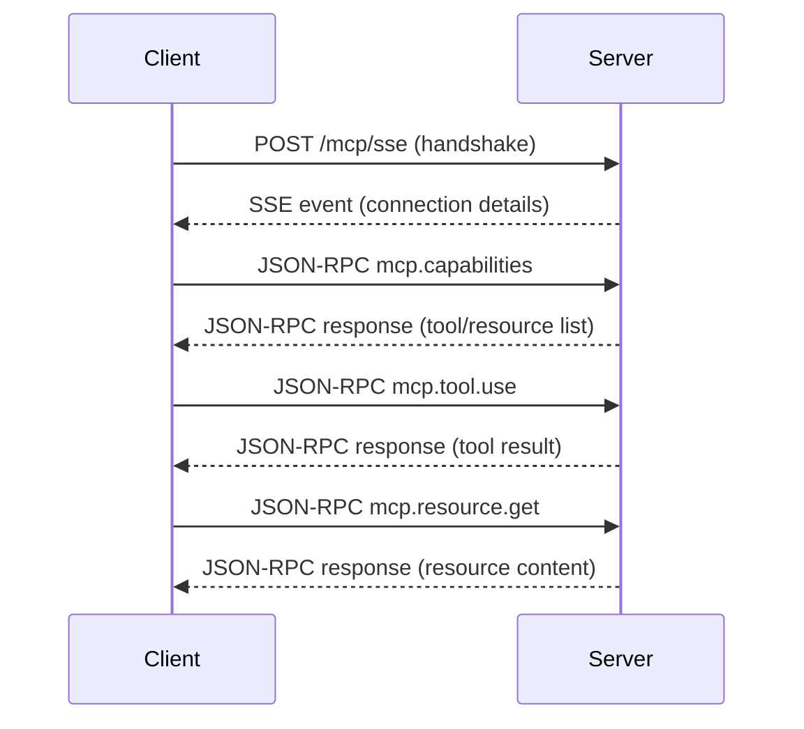

# MCP-Server-Template API Reference

This document provides detailed specifications for the MCP server endpoints, JSON-RPC methods, request/response schemas, and examples.

**🎯 MCP COMPLIANCE STATUS: 100% COMPLIANT**

This server is fully compliant with the official Model Context Protocol (MCP) specification version 2024-11-05, including:
- ✅ Complete session management with `Mcp-Session-Id` headers
- ✅ Protocol initialization handshake (`initialize` and `initialized` methods)
- ✅ Capability negotiation with proper version support
- ✅ Modern transport interfaces with callback support
- ✅ Standard JSON-RPC 2.0 error codes (-32700, -32600, -32601, -32602, -32603)
- ✅ Official SSE pattern (GET for connection + POST for messages)
- ✅ Both modern (`tools/list`, `tools/call`) and legacy (`mcp.tool.use`) method support
- ✅ Transport callbacks (`onclose`, `onerror`, `onmessage`)

---

## Additional Documentation

- **[README.md](README.md)**: Technical documentation with setup instructions and configuration details.
- **[CODE_STRUCTURE.md](CODE_STRUCTURE.md)**: Detailed explanation of each source file and its purpose.
- **[OVERVIEW.md](OVERVIEW.md)**: High-level architecture and conceptual overview.

## 1. Endpoints

The MCP server provides multiple endpoint types following official MCP patterns:

### 1.1 Modern Streamable HTTP Endpoint: `/mcp` (Recommended)

- **Method**: `POST`
- **Description**: Modern approach for JSON-RPC messaging with chunked transfer encoding and session management.
- **Content-Type**: `application/json`
- **Headers**: `Mcp-Session-Id` (required after initialization)

### 1.2 Official SSE Pattern (Recommended)

#### SSE Connection: `/mcp/sse`
- **Method**: `GET` 
- **Description**: Establishes Server-Sent Events connection following official MCP pattern.
- **Content-Type**: `text/event-stream`

#### SSE Messages: `/mcp/messages`
- **Method**: `POST`
- **Description**: Send JSON-RPC messages to established SSE connection.
- **Content-Type**: `application/json`

### 1.3 Legacy SSE Endpoint: `/mcp/sse` (Backward Compatibility)

- **Method**: `POST`
- **Description**: Legacy single-endpoint approach maintained for backward compatibility.
- **Content-Type**: `application/json`
- **Accept**: `text/event-stream`

## 2. Session Management & Protocol Initialization

### 2.1 Initialize Protocol Connection

All MCP connections must start with protocol initialization:

**Request**:
```json
{
  "jsonrpc": "2.0",
  "method": "initialize",
  "id": 1,
  "params": {
    "protocolVersion": "2024-11-05",
    "capabilities": {
      "tools": { "listChanged": true },
      "resources": { "listChanged": true }
    },
    "clientInfo": {
      "name": "ExampleClient",
      "version": "1.0.0"
    }
  }
}
```

**Response**:
```json
{
  "jsonrpc": "2.0",
  "result": {
    "protocolVersion": "2024-11-05",
    "capabilities": {
      "tools": { "listChanged": true },
      "resources": { "listChanged": true },
      "prompts": { "listChanged": true },
      "logging": {}
    },
    "serverInfo": {
      "name": "WebCrawler-MCP",
      "version": "1.0.0",
      "description": "MCP Server with web crawling capabilities"
    },
    "instructions": "MCP server for web crawling capabilities. Use tools/list to see available tools and resources/list for available resources."
  },
  "id": 1
}
```

**Response Headers**: `Mcp-Session-Id: <uuid>`

### 2.2 Complete Initialization

After receiving the initialize response, send the initialized notification:

**Request**:
```json
{
  "jsonrpc": "2.0",
  "method": "notifications/initialized"
}
```

**Response**: `202 Accepted` (no content)

## 3. Connection Initialization (Legacy)

### 2.1 Streamable HTTP Connection (`/mcp`)

**Request**:

```http
POST /mcp HTTP/1.1
Host: <server>
Content-Type: application/json

{ }
```

**Response** (chunked):
```
{"jsonrpc":"2.0","result":{"mcp":{
  "name":"<serverName>",
  "version":"<version>",
  "description":"<description>"
}},"id":null}

```

### 2.2 SSE Connection (`/mcp/sse`)

**Request**:

```http
POST /mcp/sse HTTP/1.1
Host: <server>
Content-Type: application/json
Accept: text/event-stream

{ }
```

#### Request Schema

```json
{
  "type": "object",
  "properties": {},
  "additionalProperties": false
}
```

**Response** (SSE stream):
```
data: {"jsonrpc":"2.0","result":{"mcp":{
  "name":"<serverName>",
  "version":"<version>",
  "description":"<description>"
}},"id":null}

```

#### SSE Event Format (JSON-RPC 2.0)

```json
{
  "type": "object",
  "properties": {
    "jsonrpc": { "const": "2.0" },
    "result": {
      "type": "object",
      "properties": {
        "mcp": {
          "type": "object",
          "properties": {
            "name": { "type": "string" },
            "version": { "type": "string" },
            "description": { "type": "string" }
          },
          "required": ["name", "version"]
        }
      },
      "required": ["mcp"]
    },
    "id": { "type": ["string", "number", "null"] }
  },
  "required": ["jsonrpc", "result", "id"]
}
```

- Each line prefixed with `data:` is a JSON-RPC message event.

---

## 3. JSON-RPC Methods

All subsequent requests and responses use JSON-RPC 2.0 protocol over either connection type.

### 3.1 mcp.capabilities

Retrieve lists of available tools and resources.

**Request**:
```json
{
  "jsonrpc": "2.0",
  "method": "mcp.capabilities",
  "params": {},
  "id": 1
}
```

#### Params Schema

```json
{
  "type": "object",
  "properties": {},
  "additionalProperties": false
}
```

**Response**:
```json
{
  "jsonrpc": "2.0",
  "result": {
    "tools": [
      { 
        "name": "crawl", 
        "description": "Crawl a website and extract text content and tables.",
        "parameterDescription": "URL to crawl along with optional crawling parameters like maxPages, depth, strategy, captureScreenshots, captureNetworkTraffic, and waitTime.",
        "returnDescription": "Object containing success status, original URL, extracted text content, optional tables, and optional error message."
      },
      { 
        "name": "crawlWithMarkdown", 
        "description": "Crawl a website and return markdown-formatted content, potentially answering a specific query.",
        "parameterDescription": "URL to crawl, optional crawling parameters, and an optional query.",
        "returnDescription": "Object containing success status, original URL, markdown content, and optional error message."
      }
    ],
    "resources": [
      { "name": "info", "uri": "info://about" }
    ]
  },
  "id": 1
}
```

#### Result Schema

```json
{
  "type": "object",
  "properties": {
    "tools": {
      "type": "array",
      "items": {
        "type": "object",
        "properties": {
          "name": { "type": "string" },
          "description": { "type": "string" },
          "parameterDescription": { "type": "object" },
          "returnDescription": { "type": "object" }
        },
        "required": ["name", "description"]
      }
    },
    "resources": {
      "type": "array",
      "items": {
        "type": "object",
        "properties": {
          "name": { "type": "string" },
          "uri": { "type": "string" }
        },
        "required": ["name", "uri"]
      }
    }
  },
  "required": ["tools", "resources"]
}
```

Schema:
- `params`: `{}`  
- `result`: `{ tools: ToolInfo[], resources: ResourceInfo[] }`

---

### 3.2 mcp.tool.use

Invoke a registered tool by name. The server provides two main crawling tools:

#### 3.2.1 crawl Tool

Basic web crawling tool that extracts text content and tables.

**Request**:
```json
{
  "jsonrpc": "2.0",
  "method": "mcp.tool.use",
  "params": {
    "name": "crawl",
    "parameters": {
      "url": "https://example.com",
      "maxPages": 3,
      "depth": 2,
      "strategy": "bfs",
      "captureScreenshots": true,
      "captureNetworkTraffic": false,
      "waitTime": 2000
    }
  },
  "id": 2
}
```

#### Params Schema for crawl

```json
{
  "type": "object",
  "properties": {
    "name": { "const": "crawl" },
    "parameters": {
      "type": "object",
      "properties": {
        "url": { "type": "string", "format": "uri" },
        "maxPages": { "type": "integer", "minimum": 1 },
        "depth": { "type": "integer", "minimum": 0 },
        "strategy": { "type": "string", "enum": ["bfs", "dfs", "bestFirst"] },
        "captureNetworkTraffic": { "type": "boolean" },
        "captureScreenshots": { "type": "boolean" },
        "waitTime": { "type": "integer", "minimum": 0 }
      },
      "required": ["url"]
    }
  },
  "required": ["name", "parameters"],
  "additionalProperties": false
}
```

**Response**:
```json
{
  "jsonrpc": "2.0",
  "result": {
    "success": true,
    "url": "https://example.com",
    "text": "Extracted visible text content...",
    "tables": [
      {
        "caption": "Table Title",
        "rows": [
          ["Header 1", "Header 2"],
          ["Row 1 Col 1", "Row 1 Col 2"]
        ]
      }
    ],
    "error": null
  },
  "id": 2
}
```

#### Result Schema for crawl

```json
{
  "type": "object",
  "properties": {
    "success": { "type": "boolean" },
    "url": { "type": "string", "format": "uri" },
    "text": { "type": "string" },
    "tables": {
      "type": "array",
      "items": {
        "type": "object",
        "properties": {
          "caption": { "type": ["string", "null"] },
          "rows": {
            "type": "array",
            "items": {
              "type": "array",
              "items": { "type": "string" }
            }
          }
        }
      }
    },
    "error": { "type": ["string", "null"] }
  },
  "required": ["success", "url", "text"]
}
```

#### 3.2.2 crawlWithMarkdown Tool

Advanced crawling tool that converts HTML content to Markdown format, optionally answering specific queries.

**Request**:
```json
{
  "jsonrpc": "2.0",
  "method": "mcp.tool.use",
  "params": {
    "name": "crawlWithMarkdown",
    "parameters": {
      "url": "https://example.com",
      "maxPages": 2,
      "depth": 1,
      "strategy": "bfs",
      "query": "What is this site about?",
      "waitTime": 1500
    }
  },
  "id": 3
}
```

#### Params Schema for crawlWithMarkdown

```json
{
  "type": "object",
  "properties": {
    "name": { "const": "crawlWithMarkdown" },
    "parameters": {
      "type": "object",
      "properties": {
        "url": { "type": "string", "format": "uri" },
        "maxPages": { "type": "integer", "minimum": 1 },
        "depth": { "type": "integer", "minimum": 0 },
        "strategy": { "type": "string", "enum": ["bfs", "dfs", "bestFirst"] },
        "query": { "type": "string" },
        "waitTime": { "type": "integer", "minimum": 0 }
      },
      "required": ["url"]
    }
  },
  "required": ["name", "parameters"],
  "additionalProperties": false
}
```

**Response**:
```json
{
  "jsonrpc": "2.0",
  "result": {
    "success": true,
    "url": "https://example.com",
    "markdown": "# Page Title\n\nContent converted to markdown...",
    "error": null
  },
  "id": 3
}
```

#### Result Schema for crawlWithMarkdown

```json
{
  "type": "object",
  "properties": {
    "success": { "type": "boolean" },
    "url": { "type": "string", "format": "uri" },
    "markdown": { "type": "string" },
    "error": { "type": ["string", "null"] }
  },
  "required": ["success", "url", "markdown"]
}
```

#### Tool Parameters Reference

Both crawling tools support the following parameters:

- **url** (required): The URL to crawl
- **maxPages** (optional): Maximum number of pages to crawl (default: 1-10 depending on configuration)
- **depth** (optional): Maximum depth for recursive crawling (default: 0-3 depending on configuration)
- **strategy** (optional): Crawling strategy - "bfs" (breadth-first), "dfs" (depth-first), or "bestFirst" (default: "bfs")
- **waitTime** (optional): Wait time in milliseconds between page loads (default: 1000ms)

Additional parameters for the `crawl` tool only:
- **captureScreenshots** (optional): Whether to capture full-page screenshots (default: false)
- **captureNetworkTraffic** (optional): Whether to monitor network requests (default: false)

Additional parameters for the `crawlWithMarkdown` tool only:
- **query** (optional): A specific question or query to focus the crawling on

#### Error Response

```json
{
  "jsonrpc": "2.0",
  "error": { "code": -32000, "message": "Error message describing the failure" },
  "id": 2
}
```

Schema:
- `params`: `{ name: "crawl" | "crawlWithMarkdown"; parameters: CrawlParams | CrawlWithMarkdownParams }`  
- `result`: `CrawlResponse | CrawlWithMarkdownResponse`

---

### 3.3 mcp.resource.list

List URIs available for a given resource.

**Request**:
```json
{
  "jsonrpc": "2.0",
  "method": "mcp.resource.list",
  "params": { "name": "info" },
  "id": 3
}
```

#### Params Schema

```json
{
  "type": "object",
  "properties": {
    "name": { "type": "string" }
  },
  "required": ["name"],
  "additionalProperties": false
}
```

**Response**:
```json
{
  "jsonrpc": "2.0",
  "result": { "uris": ["info://about"] },
  "id": 3
}
```

#### Result Schema

```json
{
  "type": "object",
  "properties": {
    "uris": {
      "type": "array",
      "items": { "type": "string" }
    }
  },
  "required": ["uris"]
}
```

Schema:
- `params`: `{ name: string }`  
- `result`: `{ uris: string[] }`

---

### 3.4 mcp.resource.get

Fetch content for a specific resource URI.

**Request**:
```json
{
  "jsonrpc": "2.0",
  "method": "mcp.resource.get",
  "params": { "uri": "info://about" },
  "id": 4
}
```

#### Params Schema

```json
{
  "type": "object",
  "properties": {
    "uri": { "type": "string" }
  },
  "required": ["uri"],
  "additionalProperties": false
}
```

**Response**:
```json
{
  "jsonrpc": "2.0",
  "result": {
    "contents": [
      { "uri": "info://about", "text": "# Server v1.0\nDetailed info..." }
    ]
  },
  "id": 4
}
```

#### Result Schema

```json
{
  "type": "object",
  "properties": {
    "contents": {
      "type": "array",
      "items": {
        "type": "object",
        "properties": {
          "uri": { "type": "string" },
          "text": { "type": "string" }
        },
        "required": ["uri", "text"]
      }
    }
  },
  "required": ["contents"]
}
```

Schema:
- `params`: `{ uri: string }`  
- `result`: `ResourceGetResponse`

---

## 4. Advanced Web Crawling Features

The MCP server includes a comprehensive web crawling service with advanced capabilities:

### 4.1 Browser Management
- **Robust Error Handling**: Improved browser initialization with proper error handling and fallback mechanisms
- **Custom Chrome Path**: Support for custom Chrome/Chromium executable paths via `PUPPETEER_EXECUTABLE_PATH` environment variable
- **Resource Management**: Automatic browser cleanup and connection management
- **Timeout Management**: Configurable timeouts to prevent hanging on slow pages (30s default)

### 4.2 Content Extraction
- **Text Extraction**: Intelligent visible text extraction that skips hidden elements, scripts, and style tags
- **Markdown Conversion**: HTML to Markdown conversion with custom rules for tables and code blocks using TurndownService
- **Table Extraction**: Structured extraction of HTML tables with caption support and row/column data
- **Screenshot Capture**: Optional full-page screenshot functionality saved to temporary directory

### 4.3 Crawling Strategies
- **Breadth-First Search (BFS)**: Default strategy for systematic exploration of pages level by level
- **Depth-First Search (DFS)**: Prioritizes deeper paths in the site structure by sorting links by path depth
- **Best-First Search**: Simple heuristic-based crawling that prioritizes shorter URL paths first

### 4.4 Advanced Options
- **Multi-page Crawling**: Support for crawling multiple pages with configurable depth and page limits
- **Network Traffic Monitoring**: Optional tracking of HTTP requests during crawling (GET, POST, etc.)
- **Wait Time Configuration**: Configurable delays between page loads to be respectful to target sites
- **Screenshot Capture**: Optional full-page screenshots saved with timestamps and URL identifiers
- **Same-Origin Policy**: Automatic filtering to only crawl pages from the same domain as the initial URL

### 4.5 Error Resilience
- **Browser Launch Fallbacks**: Multiple strategies for browser initialization with custom Chrome executable paths
- **Connection Recovery**: Automatic reconnection handling for disconnected browsers
- **URL Validation**: Robust URL parsing and validation with error handling for malformed URLs
- **Page Navigation Timeouts**: 30-second timeouts to prevent hanging on unresponsive pages
- **Graceful Error Handling**: Comprehensive error responses with descriptive error messages

### 4.6 Configuration Options

The following environment variables control crawling behavior:

- `CRAWL_DEFAULT_MAX_PAGES`: Default maximum pages to crawl (default: 10)
- `CRAWL_DEFAULT_DEPTH`: Default crawl depth (default: 3) 
- `CRAWL_DEFAULT_STRATEGY`: Default crawl strategy - bfs|dfs|bestFirst (default: bfs)
- `CRAWL_DEFAULT_WAIT_TIME`: Default wait time in ms between requests (default: 1000)
- `PUPPETEER_EXECUTABLE_PATH`: Custom path to Chrome/Chromium executable
- `PUPPETEER_SKIP_DOWNLOAD`: Skip automatic Chromium download during installation

---

## 5. Sequence Diagram

Below is a high-level interaction flow using [Mermaid](https://mermaid-js.github.io) syntax.



### Sequence Notes

- SSE handshake establishes an open stream for JSON-RPC messages.
- JSON-RPC requests and responses are sent as discrete `data:` events.
- Clients should handle reconnection logic and event ID tracking if the stream drops.

## 6. Examples

### 6.1 Basic Web Crawling Example

```bash
curl -X POST http://localhost:3000/mcp \
  -H "Content-Type: application/json" \
  -d '{
    "jsonrpc": "2.0",
    "method": "mcp.tool.use",
    "params": {
      "name": "crawl",
      "parameters": {
        "url": "https://example.com",
        "maxPages": 1
      }
    },
    "id": 1
  }'
```

### 6.2 Advanced Multi-page Crawling with Screenshots

```bash
curl -X POST http://localhost:3000/mcp \
  -H "Content-Type: application/json" \
  -d '{
    "jsonrpc": "2.0",
    "method": "mcp.tool.use",
    "params": {
      "name": "crawl",
      "parameters": {
        "url": "https://example.com",
        "maxPages": 5,
        "depth": 2,
        "strategy": "bfs",
        "captureScreenshots": true,
        "captureNetworkTraffic": false,
        "waitTime": 2000
      }
    },
    "id": 2
  }'
```

### 6.3 Markdown Conversion with Query

```bash
curl -X POST http://localhost:3000/mcp \
  -H "Content-Type: application/json" \
  -d '{
    "jsonrpc": "2.0",
    "method": "mcp.tool.use",
    "params": {
      "name": "crawlWithMarkdown",
      "parameters": {
        "url": "https://example.com/docs",
        "maxPages": 3,
        "depth": 1,
        "strategy": "dfs",
        "query": "What are the main features?",
        "waitTime": 1500
      }
    },
    "id": 3
  }'
```

*End of MCP API Reference*
