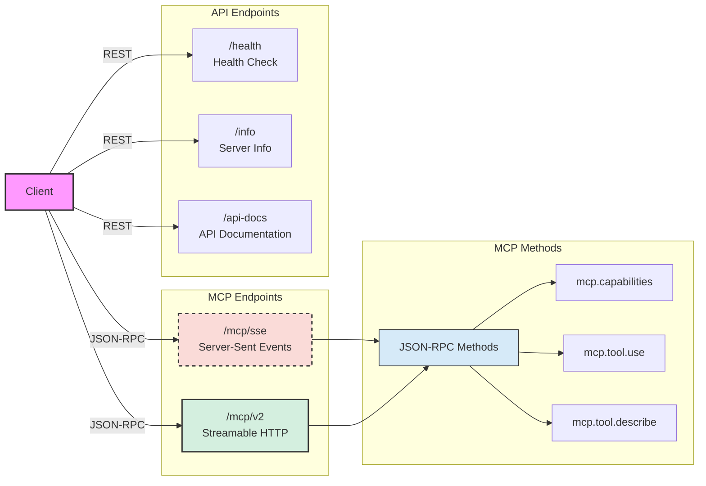
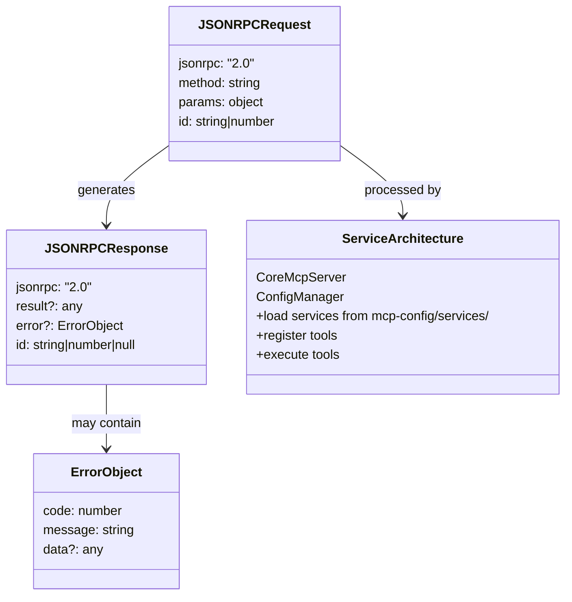
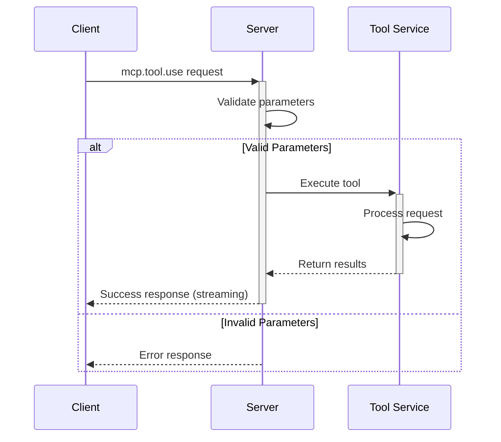
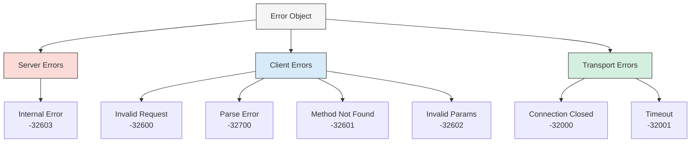
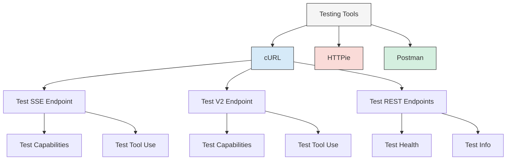

# MCP-Server-Template API Reference

This document provides detailed specifications for the MCP server endpoints, JSON-RPC methods, request/response schemas, and examples.

## 📚 Related Documentation

<table>
  <tr>
    <td align="center"><b><a href="README.md">🏠 Main README</a></b></td>
    <td>Technical documentation with setup instructions and configuration details</td>
  </tr>
  <tr>
    <td align="center"><b><a href="CODE_STRUCTURE.md">🗂️ Code Structure</a></b></td>
    <td>Detailed explanation of each source file and its purpose</td>
  </tr>
  <tr>
    <td align="center"><b><a href="OVERVIEW.md">📐 Architecture Overview</a></b></td>
    <td>High-level architecture and conceptual overview</td>
  </tr>
</table>

## 🔍 API Overview

<div align="center">


```mermaid
graph LR
    Client[Client]
    
    subgraph "MCP Endpoints"
        SSE["/mcp/sse<br>Server-Sent Events"]
        V2["/mcp/v2<br>Streamable HTTP"]
    end
    
    subgraph "API Endpoints"
        Health["/health<br>Health Check"]
        Info["/info<br>Server Info"]
        ApiDocs["/api-docs<br>API Documentation"]
    end
    
    Client -->|JSON-RPC| SSE
    Client -->|JSON-RPC| V2
    Client -->|REST| Health
    Client -->|REST| Info
    Client -->|REST| ApiDocs
    
    SSE --> Methods
    V2 --> Methods
    
    subgraph "MCP Methods"
        Methods[JSON-RPC Methods]
        Methods --> Capabilities[mcp.capabilities]
        Methods --> ToolUse[mcp.tool.use]
        Methods --> ToolDesc[mcp.tool.describe]
    end
    
    style Client fill:#f9f,stroke:#333,stroke-width:2px
    style SSE fill:#fadbd8,stroke:#333,stroke-width:2px,stroke-dasharray: 5 5
    style V2 fill:#d4efdf,stroke:#333,stroke-width:2px
    style Methods fill:#d6eaf8,stroke:#333,stroke-width:1px
```

</div>

## 📡 Transport Options

The MCP server supports two transport mechanisms:

1. **Streamable HTTP** (`/mcp/v2`) - Recommended
   - Modern HTTP streaming with chunked encoding
   - Better compatibility with proxies and firewalls
   - Simpler client implementation

2. **Server-Sent Events** (`/mcp/sse`) - Legacy
   - Uses the EventSource API
   - May have issues with some proxies
   - Not recommended for new implementations

## 🔌 REST Endpoints

### Health Check Endpoint

Provides the current health status of the server.

- **URL**: `/health`
- **Method**: `GET`
- **Content-Type**: `application/json`

#### Response

```json
{
  "status": "ok",
  "timestamp": "2025-05-04T00:08:49.982Z",
  "version": "1.0.0"
}
```

### Server Information Endpoint

Provides information about the server.

- **URL**: `/info`
- **Method**: `GET`
- **Content-Type**: `application/json`

#### Response

```json
{
  "name": "Webcrawl-MCP",
  "version": "1.0.0",
  "description": "MCP Server for Webcrawl",
  "environment": "production"
}
```

### API Documentation Endpoint

Provides an overview of available endpoints.

- **URL**: `/api-docs`
- **Method**: `GET`
- **Content-Type**: `application/json`

#### Response

```json
{
  "message": "API documentation",
  "mcp": {
    "sse": "/mcp/sse",
    "streamable": "/mcp/v2",
    "documentation": "https://github.com/microsoft/modelcontextprotocol/blob/main/specification/protocol.md"
  },
  "api": {
    "health": "/health",
    "info": "/info"
  }
}
```

## 📊 MCP Protocol Methods

All MCP methods follow the [JSON-RPC 2.0](https://www.jsonrpc.org/specification) protocol. Every request must include:

- `jsonrpc`: Always set to `"2.0"`
- `method`: The method name (e.g., `"mcp.capabilities"`)
- `params`: Method-specific parameters (object)
- `id`: Client-defined request identifier (string or number)

<div align="center">


```mermaid
classDiagram
    class JSONRPCRequest {
        jsonrpc: "2.0"
        method: string
        params: object
        id: string|number
    }
    
    class JSONRPCResponse {
        jsonrpc: "2.0"
        result?: any
        error?: ErrorObject
        id: string|number|null
    }
    
    class ErrorObject {
        code: number
        message: string
        data?: any
    }
    
    class ServiceArchitecture {
        CoreMcpServer
        ConfigManager
        +load services from mcp-config/services/
        +register tools
        +execute tools
    }
    
    JSONRPCRequest --> JSONRPCResponse: generates
    JSONRPCResponse --> ErrorObject: may contain
    JSONRPCRequest --> ServiceArchitecture: processed by
```

</div>

### 1. mcp.capabilities

Retrieves information about the server and available tools.

#### Request

```json
{
  "jsonrpc": "2.0",
  "method": "mcp.capabilities",
  "params": {},
  "id": 1
}
```

#### Response

```json
{
  "jsonrpc": "2.0",
  "result": {
    "name": "Webcrawl-MCP",
    "version": "1.0.0",
    "description": "MCP Server for Webcrawl",
    "transports": [
      {
        "type": "sse",
        "path": "/mcp/sse"
      },
      {
        "type": "streamable-http",
        "path": "/mcp/v2"
      }
    ],
    "tools": [
      {
        "name": "crawl",
        "description": "Crawl a website and extract text content and tables."
      },
      {
        "name": "crawlWithMarkdown",
        "description": "Crawl a website and return markdown-formatted content."
      }
    ]
  },
  "id": 1
}
```

### 2. mcp.tool.describe

Gets detailed information about a specific tool.

#### Request

```json
{
  "jsonrpc": "2.0",
  "method": "mcp.tool.describe",
  "params": {
    "name": "crawl"
  },
  "id": 2
}
```

#### Response

```json
{
  "jsonrpc": "2.0",
  "result": {
    "name": "crawl",
    "description": "Crawl a website and extract text content and tables.",
    "parameterDescription": "URL to crawl along with optional crawling parameters like maxPages, depth, strategy, etc.",
    "returnDescription": "Object containing success status, original URL, extracted text content, optional tables, and optional error message.",
    "parameters": {
      "type": "object",
      "properties": {
        "url": {
          "type": "string",
          "format": "uri",
          "description": "The URL to crawl"
        },
        "maxPages": {
          "type": "integer",
          "minimum": 1,
          "description": "Maximum number of pages to crawl"
        },
        "depth": {
          "type": "integer",
          "minimum": 0,
          "description": "Maximum depth of links to follow"
        },
        "strategy": {
          "type": "string",
          "enum": ["bfs", "dfs", "bestFirst"],
          "description": "Crawling strategy to use"
        },
        "captureNetworkTraffic": {
          "type": "boolean",
          "description": "Whether to capture network traffic during crawling"
        },
        "captureScreenshots": {
          "type": "boolean",
          "description": "Whether to capture screenshots during crawling"
        },
        "waitTime": {
          "type": "integer",
          "minimum": 0,
          "description": "Time to wait between requests in milliseconds"
        }
      },
      "required": ["url"]
    },
    "returns": {
      "type": "object",
      "properties": {
        "success": {
          "type": "boolean",
          "description": "Whether the operation was successful"
        },
        "url": {
          "type": "string",
          "format": "uri",
          "description": "The original URL that was crawled"
        },
        "text": {
          "type": "string",
          "description": "Extracted text content"
        },
        "tables": {
          "type": "array",
          "description": "Extracted tables, if any"
        },
        "error": {
          "type": "string",
          "description": "Error message, if any"
        }
      },
      "required": ["success", "url", "text"]
    }
  },
  "id": 2
}
```

### 3. mcp.tool.use

Executes a tool with the provided parameters.

<div align="center">


```mermaid
sequenceDiagram
    participant Client
    participant Server
    participant Tool as Tool Service
    
    Client->>+Server: mcp.tool.use request
    Server->>Server: Validate parameters
    
    alt Valid Parameters
        Server->>+Tool: Execute tool
        Tool->>Tool: Process request
        Tool-->>-Server: Return results
        Server-->>-Client: Success response (streaming)
    else Invalid Parameters
        Server-->>Client: Error response
    end
```

</div>

#### Request (crawl tool)

```json
{
  "jsonrpc": "2.0",
  "method": "mcp.tool.use",
  "params": {
    "name": "crawl",
    "parameters": {
      "url": "https://example.com",
      "maxPages": 5,
      "depth": 2,
      "strategy": "bfs"
    }
  },
  "id": 3
}
```

#### Response

```json
{
  "jsonrpc": "2.0",
  "result": {
    "success": true,
    "url": "https://example.com",
    "text": "Example Domain\nThis domain is for use in illustrative examples in documents...",
    "tables": []
  },
  "id": 3
}
```

#### Request (crawlWithMarkdown tool)

```json
{
  "jsonrpc": "2.0",
  "method": "mcp.tool.use",
  "params": {
    "name": "crawlWithMarkdown",
    "parameters": {
      "url": "https://example.com",
      "query": "What is this website about?"
    }
  },
  "id": 4
}
```

#### Response

```json
{
  "jsonrpc": "2.0",
  "result": {
    "success": true,
    "url": "https://example.com",
    "markdown": "# Example Domain\n\nThis domain is used for illustrative examples in documents.\n\n## Purpose\n\nThis website is specifically reserved for use in documentation and as an example...",
    "error": null
  },
  "id": 4
}
```

## ❌ Error Handling

<div align="center">


```mermaid
graph TD
    Error[Error Object] --> ServerErrors[Server Errors]
    Error --> ClientErrors[Client Errors]
    Error --> TransportErrors[Transport Errors]
    
    ServerErrors --> InternalError["Internal Error<br>-32603"]
    
    ClientErrors --> InvalidRequest["Invalid Request<br>-32600"]
    ClientErrors --> ParseError["Parse Error<br>-32700"]
    ClientErrors --> MethodNotFound["Method Not Found<br>-32601"]
    ClientErrors --> InvalidParams["Invalid Params<br>-32602"]
    
    TransportErrors --> ConnectionClosed["Connection Closed<br>-32000"]
    TransportErrors --> TimeoutError["Timeout<br>-32001"]
    
    style Error fill:#f5f5f5,stroke:#333,stroke-width:1px
    style ServerErrors fill:#fadbd8,stroke:#333,stroke-width:1px
    style ClientErrors fill:#d6eaf8,stroke:#333,stroke-width:1px
    style TransportErrors fill:#d4efdf,stroke:#333,stroke-width:1px
```

</div>

JSON-RPC 2.0 error responses have the following structure:

```json
{
  "jsonrpc": "2.0",
  "error": {
    "code": -32000,
    "message": "Error message",
    "data": { /* additional information */ }
  },
  "id": 1
}
```

### Standard Error Codes

| Code | Message | Description |
|------|---------|-------------|
| -32700 | Parse error | Invalid JSON was received |
| -32600 | Invalid request | The JSON-RPC request is invalid |
| -32601 | Method not found | The requested method does not exist |
| -32602 | Invalid params | Invalid method parameters |
| -32603 | Internal error | Internal server error |
| -32000 to -32099 | Server error | Implementation-defined server errors |

## 🧪 Testing with cURL

<div align="center">


```mermaid
graph TD
    Testing[Testing Tools] --> CURL[cURL]
    Testing --> HTTPie[HTTPie]
    Testing --> Postman[Postman]
    
    CURL --> SSE_Test[Test SSE Endpoint]
    CURL --> V2_Test[Test V2 Endpoint]
    CURL --> API_Test[Test REST Endpoints]
    
    SSE_Test --> SSE_Cap[Test Capabilities]
    SSE_Test --> SSE_Use[Test Tool Use]
    
    V2_Test --> V2_Cap[Test Capabilities]
    V2_Test --> V2_Use[Test Tool Use]
    
    API_Test --> Health_Test[Test Health]
    API_Test --> Info_Test[Test Info]
    
    style Testing fill:#f5f5f5,stroke:#333,stroke-width:1px
    style CURL fill:#d6eaf8,stroke:#333,stroke-width:1px
    style HTTPie fill:#fadbd8,stroke:#333,stroke-width:1px
    style Postman fill:#d4efdf,stroke:#333,stroke-width:1px
```

</div>

### Testing REST Endpoints

```bash
# Health check
curl http://localhost:${PORT:-3000}/health

# Server info
curl http://localhost:${PORT:-3000}/info

# API documentation
curl http://localhost:${PORT:-3000}/api-docs
```

### Testing MCP Streamable HTTP Endpoint (Recommended)

```bash
# Get capabilities
curl -X POST http://localhost:${PORT:-3000}/mcp/v2 \
  -H "Content-Type: application/json" \
  -d '{
      "jsonrpc": "2.0",
      "method": "mcp.capabilities",
      "params": {},
      "id": 1
    }'

# Execute crawl tool
curl -X POST http://localhost:${PORT:-3000}/mcp/v2 \
  -H "Content-Type: application/json" \
  -d '{
      "jsonrpc": "2.0",
      "method": "mcp.tool.use",
      "params": {
        "name": "crawl",
        "parameters": { "url": "https://example.com", "maxPages": 1 }
      },
      "id": 2
    }'
```

### Testing MCP SSE Endpoint (Legacy)

```bash
# Get capabilities
curl -N -X POST http://localhost:${PORT:-3000}/mcp/sse \
  -H "Content-Type: application/json" \
  -d '{
      "jsonrpc": "2.0",
      "method": "mcp.capabilities",
      "params": {},
      "id": 1
    }'

# Execute crawl tool
curl -N -X POST http://localhost:${PORT:-3000}/mcp/sse \
  -H "Content-Type: application/json" \
  -d '{
      "jsonrpc": "2.0",
      "method": "mcp.tool.use",
      "params": {
        "name": "crawl",
        "parameters": { "url": "https://example.com", "maxPages": 1 }
      },
      "id": 2
    }'
```

## 📈 Performance Considerations

1. **Streaming Responses**: For large responses, data is streamed in chunks to avoid memory issues.
2. **Connection Handling**: SSE connections are automatically closed after a period of inactivity.
3. **Rate Limiting**: Configurable rate limits prevent abuse.
4. **Timeout Handling**: Long-running operations have configurable timeouts.

## 🔄 Complete Interaction Flow

<div align="center">

```mermaid
sequenceDiagram
    participant Client
    participant Server
    participant CrawlTool
    participant Website
    
    Note over Client,Server: 1. Discover Available Tools
    Client->>+Server: POST /mcp/v2 (mcp.capabilities)
    Server-->>-Client: Tool list response
    
    Note over Client,Server: 2. Get Tool Details (Optional)
    Client->>+Server: POST /mcp/v2 (mcp.tool.describe)
    Server-->>-Client: Tool schema response
    
    Note over Client,Server: 3. Use Crawl Tool
    Client->>+Server: POST /mcp/v2 (mcp.tool.use)
    Server->>+CrawlTool: Execute crawl with parameters
    CrawlTool->>+Website: HTTP requests
    Website-->>-CrawlTool: HTML content
    CrawlTool->>CrawlTool: Extract content
    CrawlTool-->>-Server: Crawl results
    
    alt Streaming Response
        loop While processing
            Server-->>Client: Partial result chunk
        end
        Server-->>-Client: Final result chunk
    else Non-Streaming Response
        Server-->>-Client: Complete response
    end
    
    Note over Client,Server: 4. Health Monitoring
    Client->>+Server: GET /health
    Server-->>-Client: Health status
```

</div>

## 🌐 Internationalization

The API supports international character sets through:

1. **UTF-8 Encoding**: All JSON responses use UTF-8 encoding
2. **URL Encoding**: URLs are properly encoded when processing parameters
3. **Language Detection**: Content extraction attempts to detect language
4. **Unicode Handling**: Full Unicode support in all text responses
