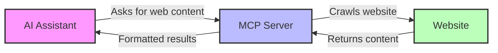
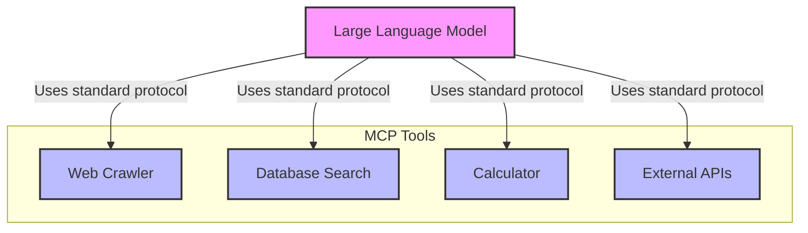
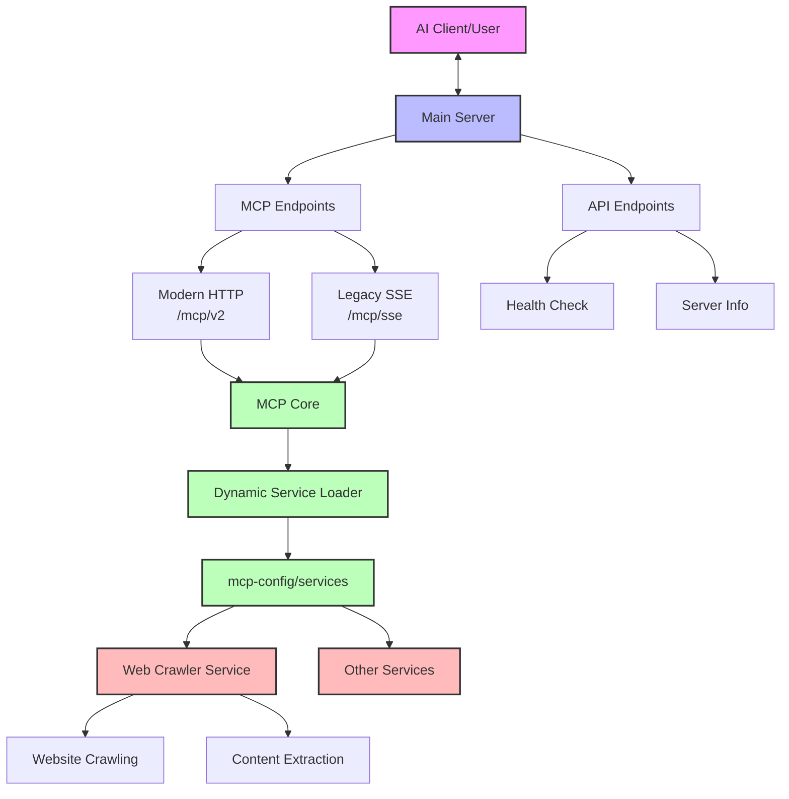
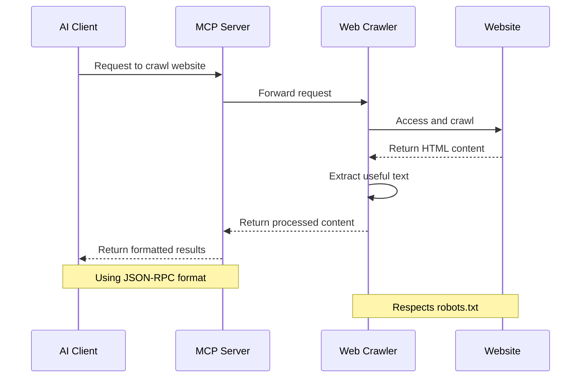
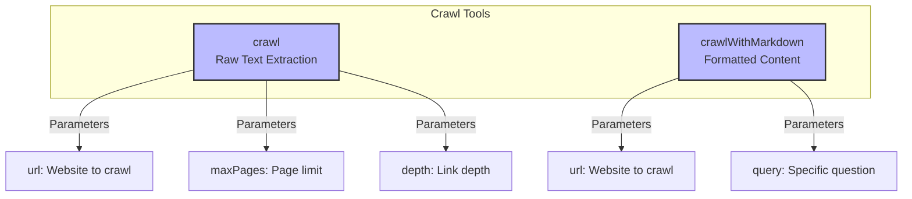
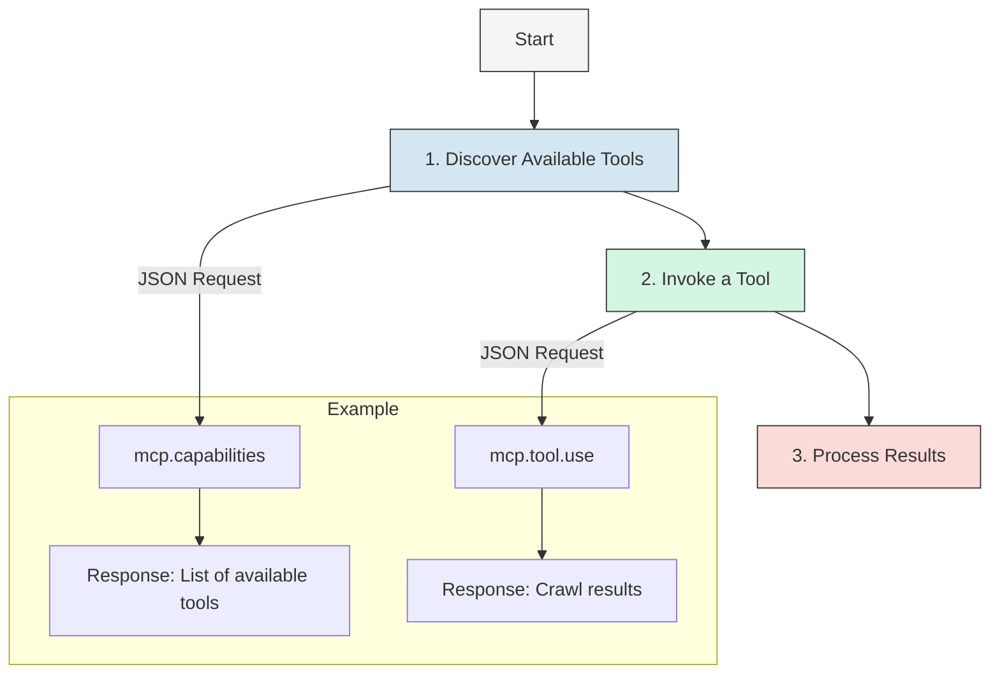
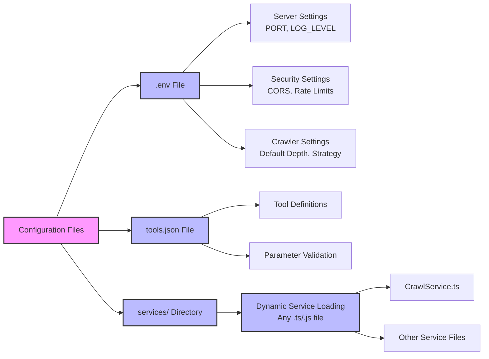

# Overview of MCP-Server-Template

## 📚 What is This Project?

This is an MCP server that helps AI systems access web content. It works like a bridge between AI models and websites, letting AI tools crawl and extract information from the web.

<div align="center">
  

  
</div>

## 📚 Related Documentation

<table>
  <tr>
    <td align="center"><b><a href="README.md">🏠 Main README</a></b></td>
    <td>Technical documentation with setup instructions and configuration details</td>
  </tr>
  <tr>
    <td align="center"><b><a href="CODE_STRUCTURE.md">🗂️ Code Structure</a></b></td>
    <td>Detailed explanation of each source file and its purpose</td>
  </tr>
  <tr>
    <td align="center"><b><a href="MCP_API.md">🔌 API Reference</a></b></td>
    <td>Detailed API endpoint specifications and JSON-RPC methods</td>
  </tr>
</table>

## 🤔 What is MCP?

MCP (Model Context Protocol) is a standard way for AI models to discover and use tools. Think of it like a universal remote control that works with many different services.

<div align="center">
  

  
</div>

MCP provides three main functions:

1. **Tool Discovery**: Find out what tools are available
2. **Tool Execution**: Use a specific tool with parameters
3. **Result Streaming**: Get results back piece by piece (helpful for long tasks)

## 🏗️ How This Project Is Built

<div align="center">
  

  
</div>

### Main Parts:

1. **Server**: Handles all incoming requests
2. **MCP Endpoints**: Two ways to connect (modern HTTP and legacy SSE)
3. **API Endpoints**: Simple endpoints for checking health and getting info
4. **MCP Core**: Processes tool requests and manages services
5. **Dynamic Service Loader**: Automatically discovers and loads service implementations from the `mcp-config/services` directory
6. **Services**: Each service provides specific functionality
   - **Crawler Service**: Handles web crawling operations
   - **Other Services**: Custom services can be added by simply creating new files in the services directory

The dynamic service loading system means you can add new functionality without modifying the core server code. Just create a new TypeScript or JavaScript file in the `mcp-config/services` directory that implements the `ToolService` interface, and it will be automatically discovered and loaded at runtime.

## 📱 How Information Flows

<div align="center">
  

  
</div>

1. **Client Requests**: An AI system asks for web content
2. **Server Processing**: Our server accepts the request and validates it
3. **Web Crawling**: Our crawler visits the website and gets the content
4. **Content Processing**: The crawler extracts useful information
5. **Response**: The processed content is sent back to the AI

## 🛠️ Available Tools

<div align="center">
  

  
</div>

The server currently provides two main tools:

1. **crawl**: Gets raw text content from websites
   - Parameters: URL, max pages, depth, strategy
   - Returns: Text content and any tables found

2. **crawlWithMarkdown**: Gets content in a nice readable format
   - Parameters: URL, max pages, depth, query
   - Returns: Markdown-formatted content that answers your query

## 🔄 How to Use It

<div align="center">
  

  
</div>

### Three Simple Steps:

1. **Discover Tools**:
   ```json
   {
     "jsonrpc": "2.0",
     "method": "mcp.capabilities",
     "params": {},
     "id": 1
   }
   ```

2. **Use a Tool**:
   ```json
   {
     "jsonrpc": "2.0",
     "method": "mcp.tool.use",
     "params": {
       "name": "crawl",
       "parameters": { "url": "https://example.com" }
     },
     "id": 2
   }
   ```

3. **Get Results**: The server returns the web content to you

## ⚙️ Easy Configuration

<div align="center">
  

  
</div>

All settings are kept in the `mcp-config` directory:

- **`.env`**: Simple settings like port numbers and logging levels
- **`tools.json`**: Defines what tools are available and how they work
- **`services/`**: Contains service implementations that are dynamically loaded:
  - **`CrawlService.ts`**: Provides web crawling functionality
  - **Additional services**: Any TypeScript or JavaScript file implementing the `ToolService` interface

This makes it easy to extend functionality by simply adding new service files without changing server code.

## 🐳 Works Great with Docker

<div align="center">
  
```mermaid
graph TD
    Host[Your Computer] --> Container[Docker Container]
    
    subgraph "Your Computer"
        ConfigFiles[mcp-config<br>Directory]
        LogVolume[Log Storage<br>Volume]
    end
    
    subgraph "Docker Container"
        MountedConfig[/app/mcp-config]
        MountedLogs[/app/logs]
        MCPServer[MCP Server]
    end
    
    ConfigFiles -->|mounted to| MountedConfig
    LogVolume -->|mounted to| MountedLogs
    
    MountedConfig --> MCPServer
    MCPServer --> MountedLogs
    
    style Host fill:#f5f5f5,stroke:#333,stroke-width:1px
    style Container fill:#d4e6f1,stroke:#333,stroke-width:1px
    style ConfigFiles fill:#d5f5e3,stroke:#333,stroke-width:1px
    style LogVolume fill:#d5f5e3,stroke:#333,stroke-width:1px
```
  
</div>

The project is ready for Docker out-of-the-box:
- Your configuration files are mounted into the container
- Logs are stored in a persistent volume
- Everything can be started with a simple `docker-compose up`

## 🔌 Available Endpoints

| Endpoint | What It Does | Status |
|----------|-------------|--------|
| `/mcp/v2` | Modern way to access MCP tools | ✅ Recommended |
| `/mcp/sse` | Legacy way to access MCP tools | ⚠️ Older method |
| `/health` | Check if server is running | ✅ Active |
| `/info` | Get server information | ✅ Active |
| `/api-docs` | API documentation | ✅ Active |
