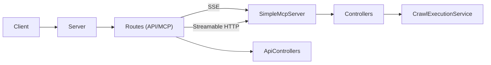

# MCP-Server-Template

This repository implements a Model Context Protocol (MCP) server for web crawling capabilities, exposing crawlers as tools for any MCP-compliant client. It features a unified server architecture with centralized configuration.

Documentation
-------------
- **[OVERVIEW.md](OVERVIEW.md)**: High-level architecture and conceptual overview.
- **[CODE_STRUCTURE.md](CODE_STRUCTURE.md)**: Detailed explanation of each source file and its purpose.
- **[MCP_API.md](MCP_API.md)**: Detailed API endpoint specifications, JSON-RPC methods, request/response schemas, examples, and sequence diagrams.

Folder Structure
----------------
```
.
├── .env                        # Environment variables configuration file
├── .env-template               # Template for environment variables
├── .github/                    # GitHub-specific files (workflows, templates)
├── .gitignore                  # Git ignore configuration
├── CODE_STRUCTURE.md           # Detailed code structure documentation
├── CONTRIBUTING.md             # Contribution guidelines
├── LICENSE.md                  # MIT License file
├── MCP_API.md                  # API specifications document
├── OVERVIEW.md                 # System overview document
├── README.md                   # Project overview and quick start (this file)
├── docker-compose.yml          # Defines multi-container environment
├── package.json                # Root package with workspace configuration
│
└── mcp-service/                # MCP server implementation
    ├── Dockerfile              # Docker configuration for MCP server
    ├── package.json            # Package configuration
    ├── tsconfig.json           # TypeScript configuration
    ├── tsconfig.node.json      # TypeScript Node.js-specific configuration
    └── src/
        ├── index.ts            # Entry point for MCP server
        ├── config/             # Centralized configuration
        │   ├── index.ts        # Main configuration entry point
        │   ├── appConfig.ts    # Application settings
        │   ├── mcpConfig.ts    # MCP-specific settings
        │   ├── securityConfig.ts # Security-related settings
        │   ├── crawlConfig.ts  # Web crawling settings
        │   └── utils.ts        # Configuration utility functions
        ├── controllers/        # API endpoint controllers
        │   ├── resourceController.ts
        │   └── toolController.ts
        ├── mcp/                # MCP protocol implementation
        │   └── SimpleMcpServer.ts
        ├── routes/             # Route definitions
        │   ├── apiRoutes.ts    # General API endpoints
        │   ├── mcpRoutes.ts    # MCP-specific endpoints (SSE)
        │   └── mcpStreamableRoutes.ts # MCP endpoints with Streamable HTTP
        ├── server/             # Unified server implementation
        │   └── server.ts       # Express and MCP server integration
        ├── services/           # Business logic services
        │   └── crawlExecutionService.ts  # Web crawling service
        └── types/              # TypeScript type definitions
            ├── mcp.ts          # MCP type definitions
            ├── modelcontextprotocol.d.ts # MCP SDK type declarations
            └── module.d.ts     # Module declarations for external libraries
```

Quick Start
-----------

### Using Docker

```
docker-compose up --build
```

### Running Locally

1. Install dependencies:
   ```bash
   npm install
   ```
2. Define environment variables (see **Configuration**).
3. Start the server:
   ```bash
   npm run build
   npm start
   ```

# API Endpoints

The server provides multiple endpoints:

- **MCP Streamable HTTP** (Recommended): `/mcp/v2` - Modern JSON-RPC over HTTP with streaming support
- **MCP SSE** (Deprecated): `/mcp/sse` - Legacy Server-Sent Events endpoint
- **API Endpoints**: `/api/health`, `/api/version` - General server information

See detailed API documentation in [MCP_API.md](MCP_API.md).

# Testing Endpoints

## MCP Streamable HTTP Endpoint (Recommended)

The modern approach recommended by the MCP specification.

### Capabilities Request
```bash
curl -X POST http://localhost:${PORT:-3000}/mcp/v2 \
  -H "Content-Type: application/json" \
  -d '{
      "jsonrpc": "2.0",
      "method": "mcp.capabilities",
      "params": {},
      "id": 1
    }'
```

### Use Tool (crawl)
```bash
curl -X POST http://localhost:${PORT:-3000}/mcp/v2 \
  -H "Content-Type: application/json" \
  -d '{
      "jsonrpc": "2.0",
      "method": "mcp.tool.use",
      "params": {
        "name": "crawl",
        "parameters": { "url": "https://example.com", "maxPages": 1 }
      },
      "id": 2
    }'
```

### Use Tool (crawlWithMarkdown)
```bash
curl -X POST http://localhost:${PORT:-3000}/mcp/v2 \
  -H "Content-Type: application/json" \
  -d '{
      "jsonrpc": "2.0",
      "method": "mcp.tool.use",
      "params": {
        "name": "crawlWithMarkdown",
        "parameters": { "url": "https://example.com", "query": "What is this site about?" }
      },
      "id": 3
    }'
```

## MCP SSE Endpoint (Deprecated)

The legacy approach that uses Server-Sent Events (SSE).

### Capabilities Request
```bash
curl -N -X POST http://localhost:${PORT:-3000}/mcp/sse \
  -H "Content-Type: application/json" \
  -d '{
      "jsonrpc": "2.0",
      "method": "mcp.capabilities",
      "params": {},
      "id": 1
    }'
```

### Use Tool (crawl)
```bash
curl -N -X POST http://localhost:${PORT:-3000}/mcp/sse \
  -H "Content-Type: application/json" \
  -d '{
      "jsonrpc": "2.0",
      "method": "mcp.tool.use",
      "params": {
        "name": "crawl",
        "parameters": { "url": "https://example.com", "maxPages": 1 }
      },
      "id": 2
    }'
```

## API Endpoints

### Health Check
```bash
curl http://localhost:${PORT:-3000}/api/health
```

Response:
```
OK
```

### Version Info
```bash
curl http://localhost:${PORT:-3000}/api/version
```

Response:
```json
{"name":"webcrawl-mcp","version":"1.0.0","description":"MCP Server for scrape websites"}
```

Environment Variables
---------------------
- `PORT` (default: 3000): Port for the MCP server.
- `MAX_REQUEST_SIZE` (default: `10mb`): Maximum HTTP payload size.
- `CORS_ORIGINS` (default: `*`): Allowed origins for CORS.
- `RATE_LIMIT_WINDOW`, `RATE_LIMIT_MAX_REQUESTS`, `CACHE_TTL`: Rate limiting and cache settings.
- `MCP_NAME`, `MCP_VERSION`, `MCP_DESCRIPTION`: MCP server identification.
- `CRAWL_DEFAULT_MAX_PAGES`, `CRAWL_DEFAULT_DEPTH`: Default crawling settings.

Configuration
-------------
All configuration is centralized in the `src/config` directory with separate modules for different aspects of the system:
- `appConfig.ts`: Core application settings
- `mcpConfig.ts`: MCP server specific settings
- `securityConfig.ts`: Security-related settings
- `crawlConfig.ts`: Web crawling default parameters

Key Components
--------------
- **Server**: Unified server implementation integrating Express and MCP capabilities.
- **Routes**: Organized in separate files for API and MCP endpoints.
- **SimpleMcpServer**: Implements MCP discovery and tool invocation logic.
- **Controllers**: `toolController` and `resourceController` for handling business logic.
- **Configuration**: Centralized configuration system with module-specific settings.
- **MCP Transport**: Supports both modern Streamable HTTP and legacy SSE transport methods.

Customization
-------------
- Add new routes in the `routes` directory.
- Extend MCP capabilities by modifying `SimpleMcpServer` or adding new controllers.
- Tune performance and security via environment variables in the `config` directory.

## Architecture Diagram


## References

- [Overview](OVERVIEW.md): High-level architecture and conceptual overview.
- [Code Structure](CODE_STRUCTURE.md): Detailed explanations of source files.
- [MCP API Reference](MCP_API.md): Endpoint specs and JSON-RPC methods.
- [Model Context Protocol SDK](https://www.npmjs.com/package/@modelcontextprotocol/sdk): Official SDK documentation.
- [MCP Transport Models](https://github.com/modelcontextprotocol/typescript-sdk#transport): Details on SSE vs Streamable HTTP.

## License

This project is licensed under the MIT License (see the `license` field in `package.json`).
