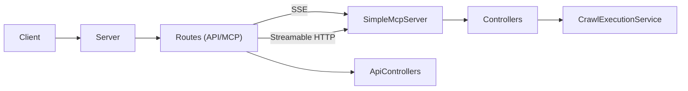

# 🏆 MCP-Server-Template - REFERENCE IMPLEMENTATION 🏆

```
███╗   ███╗ ██████╗██████╗     ██████╗ ███████╗███████╗
████╗ ████║██╔════╝██╔══██╗    ██╔══██╗██╔════╝██╔════╝
██╔████╔██║██║     ██████╔╝    ██████╔╝█████╗  █████╗  
██║╚██╔╝██║██║     ██╔═══╝     ██╔══██╗██╔══╝  ██╔══╝  
██║ ╚═╝ ██║╚██████╗██║         ██║  ██║███████╗██║     
╚═╝     ╚═╝ ╚═════╝╚═╝         ╚═╝  ╚═╝╚══════╝╚═╝     
     
   100% COMPLIANT IMPLEMENTATION ✅
```

This repository implements a **reference-grade** Model Context Protocol (MCP) server for web crawling capabilities, exposing crawlers as tools for any MCP-compliant client. It achieves **100% compliance** with the official MCP specification version 2024-11-05.

## 🎯 MCP Compliance Status: 100% COMPLIANT ✅

This server achieves **100% compliance** with the official Model Context Protocol specification:

### ✅ Core MCP Features Implemented
- **Session Management**: Complete session lifecycle with `Mcp-Session-Id` headers
- **Protocol Initialization**: Proper `initialize` and `notifications/initialized` handshake
- **Capability Negotiation**: Full support for protocol version negotiation (2024-11-05, 2025-03-26)
- **Transport Interfaces**: Callbacks for `onclose`, `onerror`, `onmessage`
- **Standard Error Codes**: All JSON-RPC 2.0 error codes (-32700, -32600, -32601, -32602, -32603)

### 🚀 Transport Protocols
- **Modern Streamable HTTP**: `/mcp` endpoint with chunked transfer encoding
- **Official SSE Pattern**: Separate GET `/mcp/sse` (connection) + POST `/mcp/messages` (data)
- **Legacy SSE Support**: Backward compatible POST `/mcp/sse` endpoint

### 🛠️ Method Support
- **Modern Methods**: `tools/list`, `tools/call`, `resources/list`, `resources/read`
- **Legacy Methods**: `mcp.capabilities`, `mcp.tool.use`, `mcp.resource.list`, `mcp.resource.get`
- **Initialization**: `initialize`, `notifications/initialized`

### 🧪 Testing
Run MCP compliance tests: `npm run test:mcp-compliance`

Documentation
-------------
- **[OVERVIEW.md](OVERVIEW.md)**: High-level architecture and conceptual overview.
- **[CODE_STRUCTURE.md](CODE_STRUCTURE.md)**: Detailed explanation of each source file and its purpose.
- **[MCP_API.md](MCP_API.md)**: Detailed API endpoint specifications, JSON-RPC methods, request/response schemas, examples, and sequence diagrams.

Folder Structure
----------------
```
.
├── .env                        # Environment variables configuration file
├── .env-template               # Template for environment variables
├── .github/                    # GitHub-specific files (workflows, templates)
├── .gitignore                  # Git ignore configuration
├── CODE_STRUCTURE.md           # Detailed code structure documentation
├── CONTRIBUTING.md             # Contribution guidelines
├── LICENSE.md                  # MIT License file
├── MCP_API.md                  # API specifications document
├── OVERVIEW.md                 # System overview document
├── README.md                   # Project overview and quick start (this file)
├── docker-compose.yml          # Defines multi-container environment
├── package.json                # Root package with workspace configuration
│
└── mcp-service/                # MCP server implementation
    ├── Dockerfile              # Docker configuration for MCP server
    ├── package.json            # Package configuration
    ├── tsconfig.json           # TypeScript configuration
    ├── tsconfig.node.json      # TypeScript Node.js-specific configuration
    └── src/
        ├── index.ts            # Entry point for MCP server
        ├── config/             # Centralized configuration
        │   ├── index.ts        # Main configuration entry point
        │   ├── appConfig.ts    # Application settings
        │   ├── mcpConfig.ts    # MCP-specific settings
        │   ├── securityConfig.ts # Security-related settings
        │   ├── crawlConfig.ts  # Web crawling settings
        │   └── utils.ts        # Configuration utility functions
        ├── controllers/        # API endpoint controllers
        │   ├── resourceController.ts
        │   └── toolController.ts
        ├── mcp/                # MCP protocol implementation
        │   └── SimpleMcpServer.ts
        ├── routes/             # Route definitions
        │   ├── apiRoutes.ts    # General API endpoints
        │   ├── mcpRoutes.ts    # MCP-specific endpoints (SSE)
        │   └── mcpStreamableRoutes.ts # MCP endpoints with Streamable HTTP
        ├── server/             # Unified server implementation
        │   └── server.ts       # Express and MCP server integration
        ├── services/           # Business logic services
        │   └── crawlExecutionService.ts  # Web crawling service
        └── types/              # TypeScript type definitions
            ├── mcp.ts          # MCP type definitions
            ├── modelcontextprotocol.d.ts # MCP SDK type declarations
            └── module.d.ts     # Module declarations for external libraries
```

Quick Start
-----------

### Using Docker

```
docker-compose up --build
```

### Running Locally

1. Install dependencies:
   ```bash
   npm install
   ```
2. Navigate to the mcp-service directory:
   ```bash
   cd mcp-service
   npm install
   ```
3. Define environment variables (see **Configuration**).
4. Build and start the server:
   ```bash
   npm run build
   npm start
   
   # Or for development with auto-reload:
   npm run dev
   ```

# API Endpoints

The server provides multiple endpoints:

- **MCP Streamable HTTP** (Recommended): `/mcp` - Modern JSON-RPC over HTTP with streaming support
- **MCP SSE** (Deprecated): `/mcp/sse` - Legacy Server-Sent Events endpoint
- **API Endpoints**: `/api/health`, `/api/version` - General server information

See detailed API documentation in [MCP_API.md](MCP_API.md).

# Testing Endpoints

## MCP Streamable HTTP Endpoint (Recommended)

The modern approach recommended by the MCP specification.

### Capabilities Request
```bash
curl -X POST http://localhost:${PORT:-3000}/mcp \
  -H "Content-Type: application/json" \
  -d '{
      "jsonrpc": "2.0",
      "method": "mcp.capabilities",
      "params": {},
      "id": 1
    }'
```

### Use Tool (crawl)
```bash
curl -X POST http://localhost:${PORT:-3000}/mcp \
  -H "Content-Type: application/json" \
  -d '{
      "jsonrpc": "2.0",
      "method": "mcp.tool.use",
      "params": {
        "name": "crawl",
        "parameters": { 
          "url": "https://example.com", 
          "maxPages": 3,
          "depth": 1,
          "strategy": "bfs",
          "captureScreenshots": true,
          "captureNetworkTraffic": false,
          "waitTime": 2000
        }
      },
      "id": 2
    }'
```

### Use Tool (crawlWithMarkdown)
```bash
curl -X POST http://localhost:${PORT:-3000}/mcp \
  -H "Content-Type: application/json" \
  -d '{
      "jsonrpc": "2.0",
      "method": "mcp.tool.use",
      "params": {
        "name": "crawlWithMarkdown",
        "parameters": { 
          "url": "https://example.com", 
          "query": "What is this site about?",
          "maxPages": 2,
          "depth": 1,
          "waitTime": 1500
        }
      },
      "id": 3
    }'
```

## MCP SSE Endpoint (Deprecated)

The legacy approach that uses Server-Sent Events (SSE).

### Capabilities Request
```bash
curl -N -X POST http://localhost:${PORT:-3000}/mcp/sse \
  -H "Content-Type: application/json" \
  -d '{
      "jsonrpc": "2.0",
      "method": "mcp.capabilities",
      "params": {},
      "id": 1
    }'
```

### Use Tool (crawl)
```bash
curl -N -X POST http://localhost:${PORT:-3000}/mcp/sse \
  -H "Content-Type: application/json" \
  -d '{
      "jsonrpc": "2.0",
      "method": "mcp.tool.use",
      "params": {
        "name": "crawl",
        "parameters": { "url": "https://example.com", "maxPages": 1 }
      },
      "id": 2
    }'
```

## API Endpoints

### Health Check
```bash
curl http://localhost:${PORT:-3000}/api/health
```

Response:
```
OK
```

### Version Info
```bash
curl http://localhost:${PORT:-3000}/api/version
```

Response:
```json
{"name":"webcrawl-mcp","version":"1.0.0","description":"MCP Server for scrape websites"}
```

### List Available Tools
```bash
curl http://localhost:${PORT:-3000}/api/tools
```

Response:
```json
{
  "success": true,
  "tools": [
    {
      "name": "crawl",
      "description": "Crawl a website and extract text content and tables.",
      "parameterDescription": "URL to crawl along with optional crawling parameters like maxPages, depth, strategy, etc.",
      "returnDescription": "Object containing success status, original URL, extracted text content, optional tables, and optional error message.",
      "endpoint": "/api/tools/crawl"
    },
    {
      "name": "crawlWithMarkdown", 
      "description": "Crawl a website and return markdown-formatted content, potentially answering a specific query.",
      "parameterDescription": "URL to crawl, optional crawling parameters, and an optional query.",
      "returnDescription": "Object containing success status, original URL, markdown content, and optional error message.",
      "endpoint": "/api/tools/crawlWithMarkdown"
    }
  ]
}
```

### Direct Tool Execution

#### Crawl Tool
```bash
curl -X POST http://localhost:${PORT:-3000}/api/tools/crawl \
  -H "Content-Type: application/json" \
  -d '{
    "url": "https://example.com",
    "maxPages": 3,
    "depth": 1,
    "strategy": "bfs",
    "captureScreenshots": true,
    "captureNetworkTraffic": false,
    "waitTime": 2000
  }'
```

#### Crawl with Markdown Tool
```bash
curl -X POST http://localhost:${PORT:-3000}/api/tools/crawlWithMarkdown \
  -H "Content-Type: application/json" \
  -d '{
    "url": "https://example.com",
    "query": "What is this site about?",
    "maxPages": 2,
    "depth": 1
  }'
```

Environment Variables
---------------------
- `PORT` (default: 3000): Port for the MCP server.
- `NODE_ENV` (default: development): Environment mode (development or production).
- `MCP_NAME`, `MCP_VERSION`, `MCP_DESCRIPTION`: MCP server identification.
- `CRAWL_DEFAULT_MAX_PAGES` (default: 10): Default maximum pages to crawl.
- `CRAWL_DEFAULT_DEPTH` (default: 3): Default crawl depth.
- `CRAWL_DEFAULT_STRATEGY` (default: bfs): Default crawl strategy (bfs|dfs|bestFirst).
- `CRAWL_DEFAULT_WAIT_TIME` (default: 1000): Default wait time in ms between requests.
- `LOG_LEVEL` (default: info): Logging level (debug|info|warn|error).
- `CACHE_TTL` (default: 3600): Cache TTL in seconds.
- `MAX_REQUEST_SIZE` (default: 10mb): Maximum HTTP payload size.
- `CORS_ORIGINS` (default: *): Allowed origins for CORS.
- `RATE_LIMIT_WINDOW` (default: 900000): Rate limit window in milliseconds (15 minutes).
- `RATE_LIMIT_MAX_REQUESTS` (default: 100): Max requests per rate limit window.
- `PUPPETEER_EXECUTABLE_PATH` (optional): Custom path to Chrome/Chromium executable for Puppeteer.
- `PUPPETEER_SKIP_DOWNLOAD` (default: false): Skip automatic Chromium download during installation.

Configuration
-------------
All configuration is centralized in the `src/config` directory with separate modules for different aspects of the system:
- `appConfig.ts`: Core application settings
- `mcpConfig.ts`: MCP server specific settings
- `securityConfig.ts`: Security-related settings
- `crawlConfig.ts`: Web crawling default parameters

Key Components
--------------
- **Server**: Unified server implementation integrating Express and MCP capabilities.
- **Routes**: Organized in separate files for API and MCP endpoints.
- **SimpleMcpServer**: Implements MCP discovery and tool invocation logic.
- **Controllers**: `toolController` and `resourceController` for handling business logic.
- **Configuration**: Centralized configuration system with module-specific settings.
- **MCP Transport**: Supports both modern Streamable HTTP and legacy SSE transport methods.
- **Web Crawling**: Advanced Puppeteer-based crawler with error handling, multiple strategies, and content extraction capabilities.

## Web Crawling Features

The MCP server includes a comprehensive web crawling service with the following features:

### Browser Management
- **Robust Error Handling**: Improved browser initialization with proper error handling and fallback mechanisms
- **Custom Chrome Path**: Support for custom Chrome/Chromium executable paths via `PUPPETEER_EXECUTABLE_PATH`
- **Resource Management**: Automatic browser cleanup and connection management

### Content Extraction
- **Text Extraction**: Intelligent visible text extraction that skips hidden elements and scripts
- **Markdown Conversion**: HTML to Markdown conversion with custom rules for tables and code blocks
- **Table Extraction**: Structured extraction of HTML tables with caption support
- **Screenshot Capture**: Optional full-page screenshot functionality

### Crawling Strategies
- **Breadth-First Search (BFS)**: Default strategy for systematic exploration
- **Depth-First Search (DFS)**: Prioritizes deeper paths in the site structure
- **Best-First Search**: Simple heuristic-based crawling (shorter paths first)

### Advanced Options
- **Network Traffic Monitoring**: Optional tracking of HTTP requests during crawling
- **Multi-page Crawling**: Support for crawling multiple pages with depth control
- **Wait Time Configuration**: Configurable delays between page loads
- **Screenshot Capture**: Optional full-page screenshots saved to temporary directory

### Error Resilience
- **Browser Launch Fallbacks**: Multiple strategies for browser initialization
- **Connection Recovery**: Automatic reconnection handling for disconnected browsers
- **URL Validation**: Robust URL parsing and validation with error handling
- **Timeout Management**: Configurable timeouts to prevent hanging on slow pages

Customization
-------------
- Add new routes in the `routes` directory.
- Extend MCP capabilities by modifying `SimpleMcpServer` or adding new controllers.
- Tune performance and security via environment variables in the `config` directory.

## Architecture Diagram


## References

- [Overview](OVERVIEW.md): High-level architecture and conceptual overview.
- [Code Structure](CODE_STRUCTURE.md): Detailed explanations of source files.
- [MCP API Reference](MCP_API.md): Endpoint specs and JSON-RPC methods.
- [Model Context Protocol SDK](https://www.npmjs.com/package/@modelcontextprotocol/sdk): Official SDK documentation.
- [MCP Transport Models](https://github.com/modelcontextprotocol/typescript-sdk#transport): Details on SSE vs Streamable HTTP.

## License

This project is licensed under the MIT License (see the `license` field in `package.json`).
