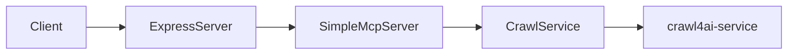
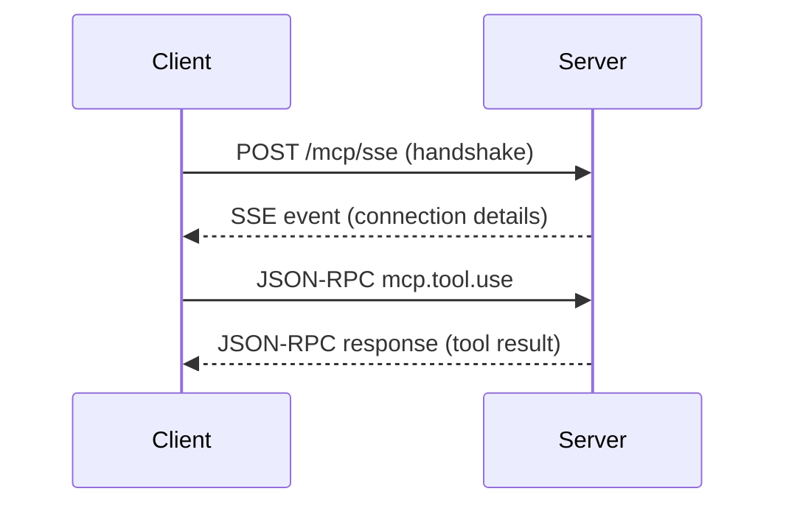
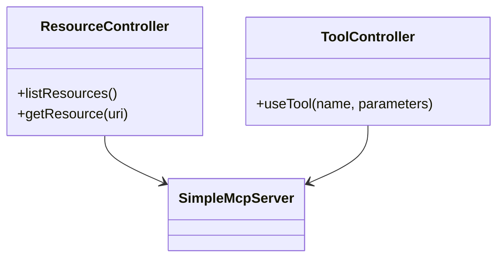

# Crawl4AI Server

This repository implements a Model Context Protocol (MCP) server for web crawling capabilities, exposing crawlers as LangChain-compatible tools or any MCP-compliant client. It includes two main services:

- **crawl4ai-server**: An Express-based MCP server that discovers and serves crawling tools.
- **crawl4ai-service**: A microservice responsible for fetching and extracting web content (source repository: https://github.com/unclecode/crawl4ai)

Documentation
-------------
- **[OVERVIEW.md](OVERVIEW.md)**: High-level architecture and conceptual overview.
- **[CODE_STRUCTURE.md](CODE_STRUCTURE.md)**: Detailed explanation of each source file and its purpose.
- **[MCP_API.md](MCP_API.md)**: Detailed API endpoint specifications, JSON-RPC methods, request/response schemas, examples, and sequence diagrams.

Folder Structure
----------------
```
.
├── Dockerfile                # Multi-stage build for production image
├── docker-compose.yml        # Defines multi-container environment
├── README.md                 # Project overview and quick start
├── OVERVIEW.md               # System overview and concepts
├── CODE_STRUCTURE.md         # Detailed code structure documentation
├── package.json              # Project metadata and dependencies
├── tsconfig.json             # TypeScript compiler configuration
├── crawl4ai-service/         # Service that performs web crawling
│   ├── Dockerfile
│   ├── package.json
│   └── src/index.ts
├── mcp-service/              # MCP server implementation
│   ├── Dockerfile
│   ├── package.json
│   ├── tsconfig.json
│   └── src/
│       ├── index.ts
│       ├── controllers/
│       ├── mcp/
│       ├── server/
│       ├── services/
│       └── types/
```

Quick Start
-----------

### Using Docker

```
docker-compose up --build
```

### Running Locally

1. Install dependencies:
   ```bash
   npm install
   ```
2. Define environment variables (see **Configuration**).
3. Start the server:
   ```bash
   npm run build
   npm start
   ```

### Running the crawl4ai-service Microservice Locally

1. Navigate to the service folder and install dependencies:
   ```bash
   cd crawl4ai-service
   npm install
   ```
2. Build and start the microservice:
   ```bash
   npm run build
   npm start
   ```
3. The microservice will be available at its default port (check `crawl4ai-service/package.json` for the `start` script or default configuration).

# API Usage Examples

See detailed API documentation in [MCP_API.md](MCP_API.md).

### Capabilities
```bash
curl -N -X POST http://localhost:${PORT:-11235}/mcp/sse \
  -H "Content-Type: application/json" \
  -d '{
      "jsonrpc": "2.0",
      "method": "mcp.capabilities",
      "params": {},
      "id": 1
    }'
```

Response:
```json
{"jsonrpc":"2.0","result":{"tools":[{"name":"crawl",...}],"resources":[{"name":"info","uri":"info://about"}]},"id":1}
```

### Use Tool (crawl)
```bash
curl -N -X POST http://localhost:${PORT:-11235}/mcp/sse \
  -H "Content-Type: application/json" \
  -d '{
      "jsonrpc": "2.0",
      "method": "mcp.tool.use",
      "params": {
        "name": "crawl",
        "parameters": { "url": "https://example.com", "maxPages": 1 }
      },
      "id": 2
    }'
```

Response:
```json
{"jsonrpc":"2.0","result":{"success":true,"url":"https://example.com","text":"<html>..."},"id":2}
```

### Resource List (info)
```bash
curl -N -X POST http://localhost:${PORT:-11235}/mcp/sse \
  -H "Content-Type: application/json" \
  -d '{
      "jsonrpc": "2.0",
      "method": "mcp.resource.list",
      "params": { "name": "info" },
      "id": 3
    }'
```

Response:
```json
{"jsonrpc":"2.0","result":{"uris":["info://about"]},"id":3}
```

### Resource Get (info://about)
```bash
curl -N -X POST http://localhost:${PORT:-11235}/mcp/sse \
  -H "Content-Type: application/json" \
  -d '{
      "jsonrpc": "2.0",
      "method": "mcp.resource.get",
      "params": { "uri": "info://about" },
      "id": 4
    }'
```

Response:
```json
{"jsonrpc":"2.0","result":{"contents":[{"uri":"info://about","text":"# MyMCPServer v1.0.0\n\nDescription..."}]},"id":4}
```

Environment Variables
---------------------
- `PORT` (default: 11235): Port for the MCP server.
- `CRAWL_SERVICE_URL`: URL of the crawl4ai-service (e.g., `http://localhost:3000`).
- `MAX_REQUEST_SIZE` (default: `10mb`): Maximum HTTP payload size.
- `CORS_ORIGINS` (default: `*`): Allowed origins for CORS.
- `RATE_LIMIT_WINDOW`, `RATE_LIMIT_MAX_REQUESTS`, `CACHE_TTL`: Rate limiting and cache settings.

Configuration
-------------
All environment variables are loaded and validated in `src/services/configService.ts`.

Key Components
--------------
- **SimpleMcpServer**: Implements MCP discovery and tool invocation logic.
- **Controllers**: `toolController` and `resourceController` for MCP and REST endpoints.
- **CrawlService**: Fetches and parses web pages.
- **ExpressServer**: Bootstraps middleware, routing, logging, and error handling.

Customization
-------------
- Add new Crawling or parsing logic in `src/services/crawlService.ts`.
- Extend MCP capabilities by modifying `src/mcp/SimpleMcpServer.ts` or adding new controllers.
- Tune performance and security via environment variables in `configService.ts`.

## Sample Diagrams

### Architecture Diagram


### Crawling Sequence Diagram


### Controllers Class Diagram


## References

- [Overview](OVERVIEW.md): High-level architecture and conceptual overview.
- [Code Structure](CODE_STRUCTURE.md): Detailed explanations of source files.
- [MCP API Reference](MCP_API.md): Endpoint specs and JSON-RPC methods.
- [Model Context Protocol SDK](https://www.npmjs.com/package/@modelcontextprotocol/sdk): Official SDK documentation.
- [Mermaid](https://mermaid-js.github.io/): Diagram syntax guide.
- [Crawl4AI Service](./crawl4ai-service/): Microservice for fetching and extracting web content.

## License

This project is licensed under the MIT License (see the `license` field in `package.json`).
