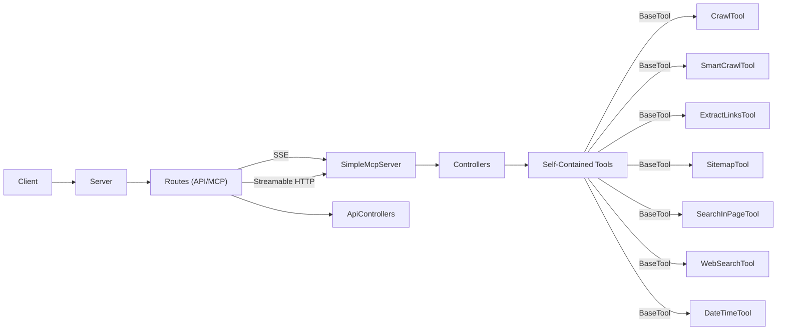

# 🏆 Webcrawl MCP Server - Production Ready Implementation 🏆

```
███╗   ███╗ ██████╗██████╗     ██████╗ ███████╗███████╗
████╗ ████║██╔════╝██╔══██╗    ██╔══██╗██╔════╝██╔════╝
██╔████╔██║██║     ██████╔╝    ██████╔╝█████╗  █████╗  
██║╚██╔╝██║██║     ██╔═══╝     ██╔══██╗██╔══╝  ██╔══╝  
██║ ╚═╝ ██║╚██████╗██║         ██║  ██║███████╗██║     
╚═╝     ╚═╝ ╚═════╝╚═╝         ╚═╝  ╚═╝╚══════╝╚═╝     
     
   100% MCP COMPLIANT | ABORT CAPABLE ✅
```

A **production-ready** Model Context Protocol (MCP) server providing comprehensive web crawling capabilities. Features intelligent content extraction, tool execution abort functionality, and full MCP specification compliance.

## 🎯 Key Features

- **✅ 100% MCP Compliant** - Full compliance with MCP specification v2024-11-05
- **🛑 Abort Functionality** - Cancel long-running operations gracefully  
- **🧠 Smart Crawling** - Intelligent content extraction with relevance scoring
- **🔗 Link Analysis** - Advanced link extraction and categorization
- **🗺️ Sitemap Generation** - Comprehensive website structure mapping
- **🔍 Content Search** - In-page content search and analysis
- **🌐 Web Search** - Integrated web search capabilities
- **⏰ Utility Tools** - Date/time and general utility functions

## � Quick Start

### Using Docker (Recommended)
```bash
docker-compose up --build
```

### Local Development
```bash
# Install dependencies
npm install
cd mcp-service && npm install

# Start development server
npm run dev
```

## 🛠️ Available Tools

| Tool | Description | Key Features |
|------|-------------|--------------|
| **crawl** | Basic web crawling | Page content, metadata, links |
| **smartCrawl** | Intelligent crawling | Relevance scoring, smart navigation |
| **extractLinks** | Link extraction | Categorization, filtering, analysis |
| **searchInPage** | Content search | Text matching, context extraction |
| **generateSitemap** | Sitemap creation | Site structure, hierarchy mapping |
| **webSearch** | Web search | Multi-engine support, result filtering |
| **getDateTime** | Date/time utilities | Timezone support, formatting |

## 🛑 Abort Functionality

All tools support graceful cancellation:

```bash
# Start a tool execution
curl -X POST http://localhost:3000/mcp \
  -H "Content-Type: application/json" \
  -d '{"jsonrpc":"2.0","method":"tools/call","params":{"name":"crawl","arguments":{"url":"https://example.com"}},"id":"tool-123"}'

# Abort the execution
curl -X POST http://localhost:3000/tools/abort/tool-123
```

## 📋 MCP Protocol Support

- **✅ Session Management**: Complete session lifecycle with `Mcp-Session-Id` headers
- **✅ Protocol Initialization**: Proper `initialize` and `notifications/initialized` handshake  
- **✅ Capability Negotiation**: Full support for protocol version negotiation
- **✅ Transport Protocols**: Modern Streamable HTTP and SSE support
- **✅ Standard Methods**: `tools/list`, `tools/call`, `resources/list`, `resources/read`
- **✅ Error Handling**: All JSON-RPC 2.0 error codes properly implemented

## 🏗️ Architecture

```
mcp-service/
├── src/
│   ├── services/tools/         # Self-contained tool implementations
│   │   ├── BaseTool.ts         # Base class with abort functionality
│   │   ├── CrawlTool.ts        # Web crawling
│   │   ├── SmartCrawlTool.ts   # Intelligent crawling
│   │   ├── ExtractLinksTool.ts # Link extraction
│   │   ├── SearchInPageTool.ts # Page search
│   │   ├── SitemapTool.ts      # Sitemap generation
│   │   ├── WebSearchTool.ts    # Web search
│   │   └── DateTimeTool.ts     # Date/time utilities
│   ├── mcp/                    # MCP protocol implementation
│   ├── routes/                 # HTTP endpoints
│   ├── controllers/            # Request handlers
│   └── config/                 # Configuration management
```

## 🔧 Configuration

### Environment Variables
```bash
# Copy template and configure
cp .env-template .env

# Key settings
PORT=3000                       # Server port
MCP_TRANSPORT=streamable-http   # Transport protocol
PUPPETEER_HEADLESS=true        # Browser mode
LOG_LEVEL=info                 # Logging level
```

### Development vs Production
- **Development**: Relaxed rate limiting (1000 requests/minute)
- **Production**: Secure defaults with stricter limits

## 🧪 Testing

```bash
# Run MCP compliance tests
npm run test:mcp-compliance

# Run all tests
npm test

# Build project
npm run build
```
```

### Running Locally

1. Install dependencies:
   ```bash
   npm install
   ```
2. Navigate to the mcp-service directory:
   ```bash
   cd mcp-service
   npm install
   ```
3. Define environment variables (see **Configuration**).
4. Build and start the server:
   ```bash
   npm run build
   npm start
   
   # Or for development with auto-reload:
   npm run dev
   ## 🌐 API Endpoints

| Endpoint | Protocol | Description |
|----------|----------|-------------|
| `POST /mcp` | MCP Streamable HTTP | **Recommended** - Modern JSON-RPC over HTTP |
| `GET /mcp` | HTTP | Server info and connection details |
| `POST /tools/abort/:toolId` | REST | Abort tool execution |
| `GET /api/health` | REST | Health check |
| `GET /api/version` | REST | Version information |

## 📝 Usage Examples

### Basic Tool Execution
```bash
# Execute crawl tool
curl -X POST http://localhost:3000/mcp \
  -H "Content-Type: application/json" \
  -d '{
    "jsonrpc": "2.0",
    "method": "tools/call",
    "params": {
      "name": "crawl",
      "arguments": {
        "url": "https://example.com",
        "maxPages": 3
      }
    },
    "id": 1
  }'
```

### Smart Crawl with Query
```bash
# Execute smart crawl with relevance scoring
curl -X POST http://localhost:3000/mcp \
  -H "Content-Type: application/json" \
  -d '{
    "jsonrpc": "2.0",
    "method": "tools/call",
    "params": {
      "name": "smartCrawl",
      "arguments": {
        "url": "https://example.com",
        "query": "pricing information",
        "maxPages": 5,
        "relevanceThreshold": 3
      }
    },
    "id": 2
  }'
```

### Tool Execution with Abort
```bash
# Start tool execution
TOOL_ID=$(curl -X POST http://localhost:3000/mcp \
  -H "Content-Type: application/json" \
  -d '{"jsonrpc":"2.0","method":"tools/call","params":{"name":"generateSitemap","arguments":{"url":"https://large-site.com","maxPages":100}},"id":"sitemap-1"}' \
  | jq -r '.result.toolId')

# Abort if needed
curl -X POST http://localhost:3000/tools/abort/$TOOL_ID
```

## 📚 Documentation

| Document | Description |
|----------|-------------|
| **[MCP_API.md](MCP_API.md)** | Complete API reference and examples |
| **[TOOL_ABORT.md](TOOL_ABORT.md)** | Tool abort functionality guide |
| **[OVERVIEW.md](OVERVIEW.md)** | Architecture and design overview |
| **[CODE_STRUCTURE.md](CODE_STRUCTURE.md)** | Developer documentation |
| **[CONTRIBUTING.md](CONTRIBUTING.md)** | Contribution guidelines |

## 🤝 Contributing

We welcome contributions! Please see [CONTRIBUTING.md](CONTRIBUTING.md) for guidelines.

## 📄 License

This project is licensed under the Creative Commons Attribution-NonCommercial 4.0 International License (CC BY-NC 4.0). This means you are free to:

- **Share** — copy and redistribute the material in any medium or format
- **Adapt** — remix, transform, and build upon the material

Under the following terms:
- **Attribution** — You must give appropriate credit
- **NonCommercial** — You may not use the material for commercial purposes

See the [LICENSE.md](LICENSE.md) file for the complete license text.

---

**Made with ❤️ for the MCP community**
      "name": "smartCrawl", 
      "description": "Crawl a website and return markdown-formatted content, potentially answering a specific query.",
      "parameterDescription": "URL to crawl, optional crawling parameters, and an optional query.",
      "returnDescription": "Object containing success status, original URL, markdown content, and optional error message.",
      "endpoint": "/api/tools/smartCrawl"
    },
    {
      "name": "extractLinks",
      "description": "Extract and categorize links from a web page.",
      "parameterDescription": "URL to extract links from.",
      "returnDescription": "Object containing internal and external links with their descriptions.",
      "endpoint": "/api/tools/extractLinks"
    },
    {
      "name": "sitemapGenerator",
      "description": "Generate a sitemap from a website by crawling its pages.",
      "parameterDescription": "URL to crawl for sitemap generation with optional depth and maxPages.",
      "returnDescription": "Object containing the generated sitemap structure.",
      "endpoint": "/api/tools/sitemapGenerator"
    },
    {
      "name": "searchInPage",
      "description": "Search for specific content within a web page.",
      "parameterDescription": "URL and search term to look for.",
      "returnDescription": "Object containing search results and matches.",
      "endpoint": "/api/tools/searchInPage"
    },
    {
      "name": "webSearch",
      "description": "Perform web search and extract results.",
      "parameterDescription": "Search query and maximum number of results.",
      "returnDescription": "Object containing search results with titles, descriptions, and URLs.",
      "endpoint": "/api/tools/webSearch"
    },
    {
      "name": "dateTime",
      "description": "Get current date and time information in various formats.",
      "parameterDescription": "Optional timezone parameter.",
      "returnDescription": "Object containing current date/time in multiple formats.",
      "endpoint": "/api/tools/dateTime"
    }
  ]
}
```

### Direct Tool Execution

#### Crawl Tool
```bash
curl -X POST http://localhost:${PORT:-3000}/api/tools/crawl \
  -H "Content-Type: application/json" \
  -d '{
    "url": "https://example.com",
    "maxPages": 3,
    "depth": 1,
    "strategy": "bfs",
    "captureScreenshots": true,
    "captureNetworkTraffic": false,
    "waitTime": 2000
  }'
```

#### Smart Crawl Tool (Markdown Output)
```bash
curl -X POST http://localhost:${PORT:-3000}/api/tools/smartCrawl \
  -H "Content-Type: application/json" \
  -d '{
    "url": "https://example.com",
    "query": "What is this site about?",
    "maxPages": 2,
    "depth": 1
  }'
```

#### Extract Links Tool
```bash
curl -X POST http://localhost:${PORT:-3000}/api/tools/extractLinks \
  -H "Content-Type: application/json" \
  -d '{
    "url": "https://example.com"
  }'
```

#### Sitemap Generator Tool
```bash
curl -X POST http://localhost:${PORT:-3000}/api/tools/sitemapGenerator \
  -H "Content-Type: application/json" \
  -d '{
    "url": "https://example.com",
    "maxPages": 10,
    "depth": 2
  }'
```

#### Search In Page Tool
```bash
curl -X POST http://localhost:${PORT:-3000}/api/tools/searchInPage \
  -H "Content-Type: application/json" \
  -d '{
    "url": "https://example.com",
    "searchTerm": "contact information"
  }'
```

#### Web Search Tool
```bash
curl -X POST http://localhost:${PORT:-3000}/api/tools/webSearch \
  -H "Content-Type: application/json" \
  -d '{
    "query": "MCP protocol specification",
    "maxResults": 5
  }'
```

#### Date Time Tool
```bash
curl -X POST http://localhost:${PORT:-3000}/api/tools/dateTime \
  -H "Content-Type: application/json" \
  -d '{
    "timezone": "UTC"
  }'
```

Environment Variables
---------------------
- `PORT` (default: 3000): Port for the MCP server.
- `NODE_ENV` (default: development): Environment mode (development or production).
- `MCP_NAME`, `MCP_VERSION`, `MCP_DESCRIPTION`: MCP server identification.
- `CRAWL_DEFAULT_MAX_PAGES` (default: 10): Default maximum pages to crawl.
- `CRAWL_DEFAULT_DEPTH` (default: 3): Default crawl depth.
- `CRAWL_DEFAULT_STRATEGY` (default: bfs): Default crawl strategy (bfs|dfs|bestFirst).
- `CRAWL_DEFAULT_WAIT_TIME` (default: 1000): Default wait time in ms between requests.
- `LOG_LEVEL` (default: info): Logging level (debug|info|warn|error).
- `CACHE_TTL` (default: 3600): Cache TTL in seconds.
- `MAX_REQUEST_SIZE` (default: 10mb): Maximum HTTP payload size.
- `CORS_ORIGINS` (default: *): Allowed origins for CORS.
- `RATE_LIMIT_WINDOW` (default: 900000): Rate limit window in milliseconds (15 minutes).
- `RATE_LIMIT_MAX_REQUESTS` (default: 100): Max requests per rate limit window.
- `PUPPETEER_EXECUTABLE_PATH` (optional): Custom path to Chrome/Chromium executable for Puppeteer.
- `PUPPETEER_SKIP_DOWNLOAD` (default: false): Skip automatic Chromium download during installation.

Configuration
-------------
All configuration is centralized in the `src/config` directory with separate modules for different aspects of the system:
- `appConfig.ts`: Core application settings
- `mcpConfig.ts`: MCP server specific settings
- `securityConfig.ts`: Security-related settings
- `crawlConfig.ts`: Web crawling default parameters

Key Components
--------------
- **Server**: Unified server implementation integrating Express and MCP capabilities.
- **Routes**: Organized in separate files for API and MCP endpoints.
- **SimpleMcpServer**: Implements MCP discovery and tool invocation logic.
- **Controllers**: `toolController` and `resourceController` for handling business logic.
- **Tools**: Self-contained tool implementations extending the BaseTool abstract class:
  - **CrawlTool**: Basic web crawling with content extraction
  - **SmartCrawlTool**: Intelligent crawling with markdown output and query support
  - **ExtractLinksTool**: Extract and categorize links from web pages
  - **SitemapTool**: Generate sitemaps from crawled content
  - **SearchInPageTool**: Search for specific content within web pages
  - **WebSearchTool**: Web search functionality with result extraction
  - **DateTimeTool**: Date and time utility functions
- **Configuration**: Centralized configuration system with module-specific settings.
- **MCP Transport**: Supports both modern Streamable HTTP and legacy SSE transport methods.
- **Tool Architecture**: Each tool includes its own browser management, crawling logic, and error handling for complete self-containment.

## Web Crawling Features

The MCP server includes a comprehensive set of self-contained crawling tools, each with integrated browser management and specialized functionality:

### Tool-Based Architecture
- **Self-Contained Design**: Each tool manages its own Puppeteer browser instance and crawling logic
- **BaseTool Abstract Class**: Common functionality shared across all tools with standardized error handling
- **Independent Operation**: Tools operate without shared service dependencies for improved reliability

### Available Tools

#### CrawlTool
- **Basic Web Crawling**: Extract text content and tables from web pages
- **Multiple Strategies**: BFS, DFS, and best-first crawling approaches
- **Screenshot Capture**: Optional full-page screenshot functionality
- **Content Extraction**: Intelligent visible text extraction skipping hidden elements

#### SmartCrawlTool  
- **Markdown Output**: HTML to Markdown conversion with custom formatting rules
- **Query-Based Crawling**: Focused content extraction based on specific queries
- **Smart Content Detection**: Enhanced relevance scoring for different content types
- **Structured Output**: Well-formatted markdown with proper headings and sections

#### ExtractLinksTool
- **Link Categorization**: Separate internal and external link extraction
- **Link Analysis**: Extract link text, URLs, and descriptions
- **Comprehensive Coverage**: Find all clickable links within page content

#### SitemapTool
- **Sitemap Generation**: Create structured sitemaps from crawled content
- **Hierarchical Structure**: Organize pages by depth and relationship
- **Configurable Depth**: Control crawling depth for sitemap generation

#### SearchInPageTool
- **Content Search**: Find specific terms or phrases within web pages
- **Context Extraction**: Provide surrounding context for search matches
- **Relevance Scoring**: Rank search results by relevance

#### WebSearchTool
- **Web Search Integration**: Perform web searches and extract results
- **Result Processing**: Extract titles, descriptions, and URLs from search results
- **Configurable Results**: Control number of results returned

#### DateTimeTool
- **Time Utilities**: Current date/time in multiple formats
- **Timezone Support**: Convert times across different timezones
- **Formatting Options**: Various date/time format outputs

### Shared Browser Management Features
- **Robust Error Handling**: Improved browser initialization with proper error handling and fallback mechanisms
- **Custom Chrome Path**: Support for custom Chrome/Chromium executable paths via `PUPPETEER_EXECUTABLE_PATH`
- **Resource Management**: Automatic browser cleanup and connection management in each tool
- **Independent Instances**: Each tool manages its own browser instance for better isolation

### Content Extraction (Across Tools)
- **Text Extraction**: Intelligent visible text extraction that skips hidden elements and scripts
- **Markdown Conversion**: HTML to Markdown conversion with custom rules for tables and code blocks
- **Table Extraction**: Structured extraction of HTML tables with caption support
- **Screenshot Capture**: Optional full-page screenshot functionality
- **Link Processing**: Extract and categorize internal vs external links

### Crawling Strategies
- **Breadth-First Search (BFS)**: Default strategy for systematic exploration
- **Depth-First Search (DFS)**: Prioritizes deeper paths in the site structure
- **Best-First Search**: Simple heuristic-based crawling (shorter paths first)

### Advanced Options
- **Network Traffic Monitoring**: Optional tracking of HTTP requests during crawling
- **Multi-page Crawling**: Support for crawling multiple pages with depth control
- **Wait Time Configuration**: Configurable delays between page loads
- **Screenshot Capture**: Optional full-page screenshots saved to temporary directory

### Error Resilience
- **Browser Launch Fallbacks**: Multiple strategies for browser initialization
- **Connection Recovery**: Automatic reconnection handling for disconnected browsers
- **URL Validation**: Robust URL parsing and validation with error handling
- **Timeout Management**: Configurable timeouts to prevent hanging on slow pages

Customization
-------------
- Add new routes in the `routes` directory.
- Extend MCP capabilities by modifying `SimpleMcpServer` or adding new controllers.
- Create new tools by extending the `BaseTool` abstract class in the `services/tools` directory.
- Each tool is self-contained and can be developed independently.
- Tune performance and security via environment variables in the `config` directory.

## Architecture Diagram


## References

- [Overview](OVERVIEW.md): High-level architecture and conceptual overview.
- [Code Structure](CODE_STRUCTURE.md): Detailed explanations of source files.
- [MCP API Reference](MCP_API.md): Endpoint specs and JSON-RPC methods.
- [Model Context Protocol SDK](https://www.npmjs.com/package/@modelcontextprotocol/sdk): Official SDK documentation.
- [MCP Transport Models](https://github.com/modelcontextprotocol/typescript-sdk#transport): Details on SSE vs Streamable HTTP.
