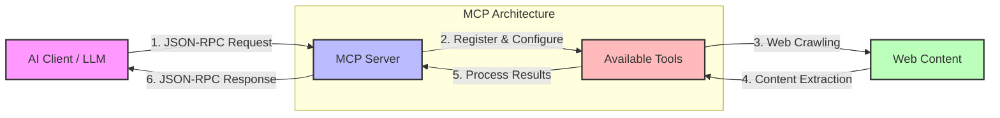
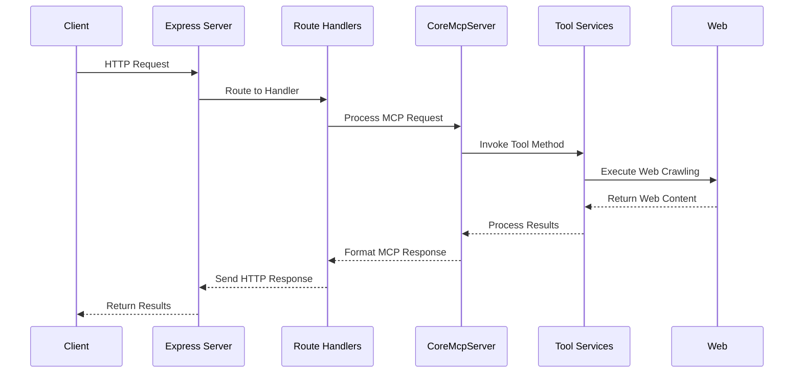
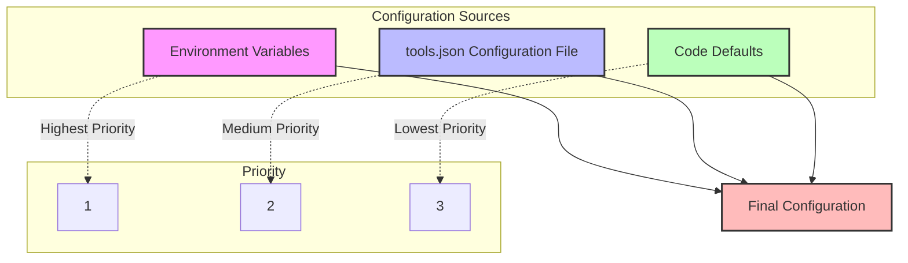
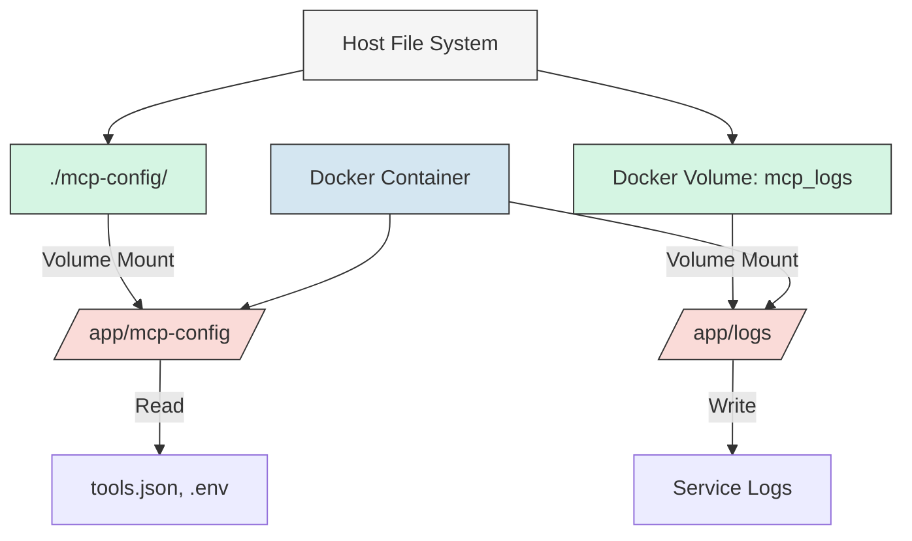
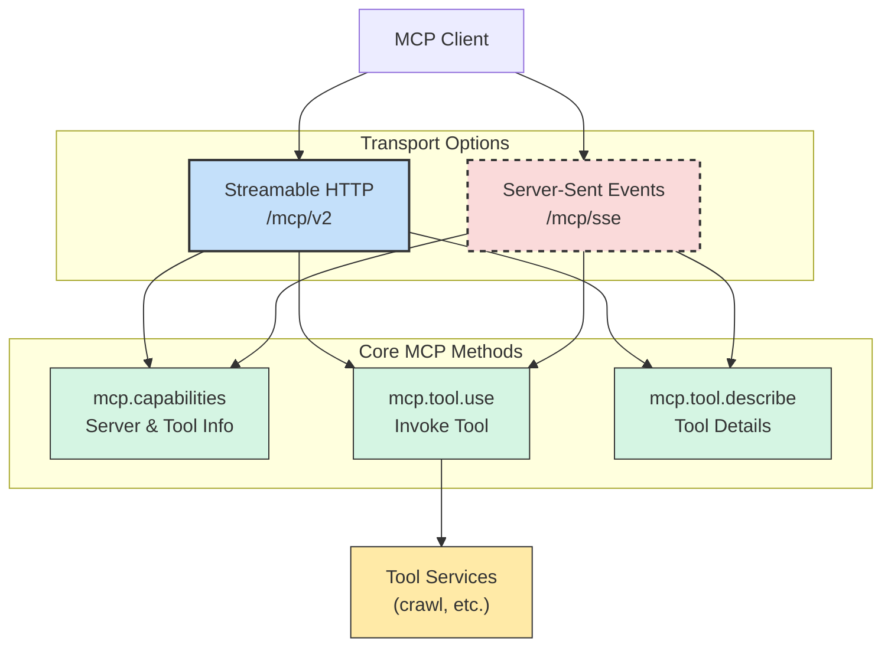
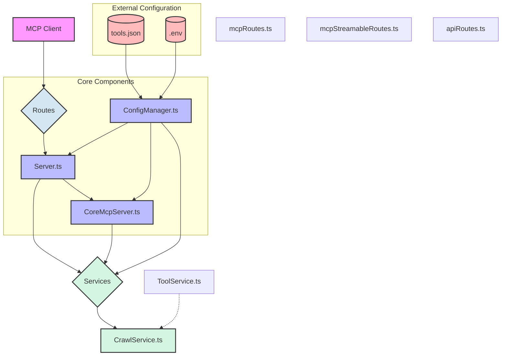
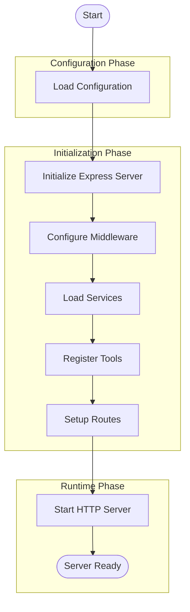
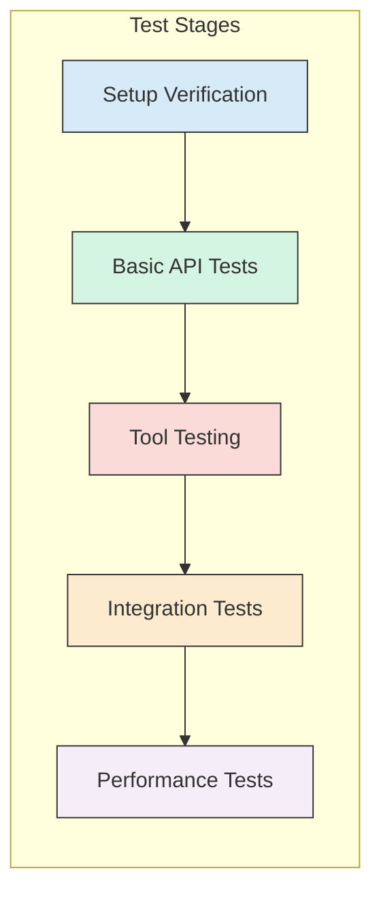
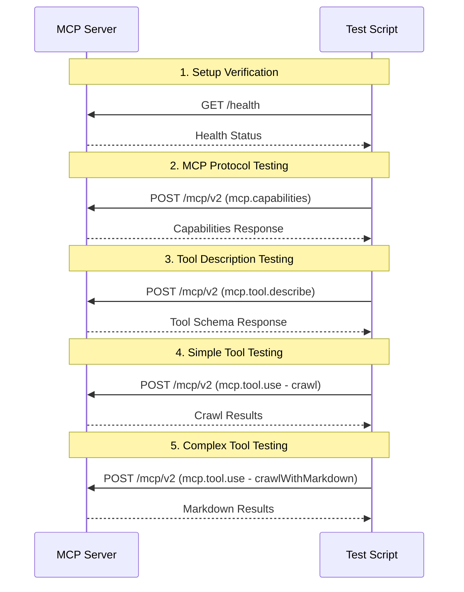

# MCP-Server-Template

<div align="center">
  
  
  
  A **Model Context Protocol** server for web crawling capabilities
  
  [](https://www.typescriptlang.org/)
  [](https://www.docker.com/)
  [](https://github.com/modelcontextprotocol/typescript-sdk)
  [](https://opensource.org/licenses/MIT)
  
</div>

This repository implements a Model Context Protocol (MCP) server for web crawling capabilities, exposing crawlers as tools for any MCP-compliant client. It features a unified server architecture with externalized configuration for Docker environments.

## 📖 What is an MCP Server?

The Model Context Protocol (MCP) enables AI models to access external tools and data sources in a standardized way. This MCP server specifically provides web crawling capabilities that can be seamlessly integrated with any MCP-compliant client, such as AI assistants, language models, or automation platforms.

<div align="center">
  

```mermaid
graph LR
    Client[AI Client / LLM]
    MCP[MCP Server]
    Web[Web Content]
    Tools[Available Tools]
    
    Client -->|1. JSON-RPC Request| MCP
    MCP -->|2. Register & Configure| Tools
    Tools -->|3. Web Crawling| Web
    Web -->|4. Content Extraction| Tools
    Tools -->|5. Process Results| MCP
    MCP -->|6. JSON-RPC Response| Client
    
    subgraph "MCP Architecture"
        MCP
        Tools
    end
    
    style Client fill:#f9f,stroke:#333,stroke-width:2px
    style MCP fill:#bbf,stroke:#333,stroke-width:2px
    style Web fill:#bfb,stroke:#333,stroke-width:2px
    style Tools fill:#fbb,stroke:#333,stroke-width:2px
```
  
</div>

### Key Features

- **Standardized Tool Interface**: Exposes web crawling functionality through a standardized JSON-RPC interface
- **Transport Layer Options**: Supports both modern HTTP streaming and Server-Sent Events (SSE) 
- **Configurable Crawling Behavior**: Customizable depth, page limits, and crawling strategies
- **Externalized Configuration**: Easily configure tools without code changes
- **Docker-Ready**: Designed for containerized deployment with proper volume management

## 📚 Documentation

<table>
  <tr>
    <td align="center"><b><a href="OVERVIEW.md">📐 Architecture Overview</a></b></td>
    <td>High-level architecture and conceptual overview of the system</td>
  </tr>
  <tr>
    <td align="center"><b><a href="CODE_STRUCTURE.md">🗂️ Code Structure</a></b></td>
    <td>Detailed explanation of each source file and its purpose</td>
  </tr>
  <tr>
    <td align="center"><b><a href="MCP_API.md">🔌 API Reference</a></b></td>
    <td>Detailed API endpoint specifications and JSON-RPC methods</td>
  </tr>
</table>

## 📁 Folder Structure

```
.
├── mcp-config/                 # External configuration directory (SINGLE SOURCE OF TRUTH)
│   ├── .env                    # Environment variables configuration file
│   ├── .env.sample             # Template for environment variables
│   ├── tools.json              # Tool definitions and configurations
│   └── services/               # Service implementations (moved from mcp-service/src)
│       └── CrawlService.ts     # Web crawler service
│
└── mcp-service/                # MCP server implementation
    ├── src/
        ├── index.ts            # Entry point for MCP server (wrapper)
        └── @core/              # Core application components
            ├── config/         # Configuration management
            ├── mcp/            # MCP protocol implementation
            ├── routes/         # Route definitions
            ├── server/         # Express server setup
            ├── services/       # Core service interfaces
            ├── types/          # Type definitions
            └── utils/          # Utility functions
```

## 🚀 Quick Start

### Using Docker (Recommended)

```bash
# Clone the repository
git clone https://github.com/SteffenHebestreit/Webcrawl-MCP.git
cd Webcrawl-MCP

# Create your environment file from the template
cp mcp-config/.env.sample mcp-config/.env

# Customize your configuration (optional)
nano mcp-config/.env
nano mcp-config/tools.json

# Start the services
docker-compose up --build
```

### Setting Up Local Hostname for Traefik

The MCP server uses Traefik as a reverse proxy and is configured to respond to the hostname `mcp.localhost`. You need to make sure this hostname resolves to your local machine:

<div align="center">
  

```mermaid
flowchart LR
    Client[Client Request]
    Hosts[Hosts File]
    DNS[DNS Lookup]
    Traefik[Traefik Proxy]
    MCP[MCP Server]
    
    Client -->|http://mcp.localhost/mcp/v2| DNS
    DNS -->|Resolves via| Hosts
    Hosts -->|127.0.0.1| Traefik
    Traefik -->|Routes to| MCP
    
    style Client fill:#f5f5f5,stroke:#333,stroke-width:1px
    style Hosts fill:#d5f5e3,stroke:#333,stroke-width:2px
    style DNS fill:#d6eaf8,stroke:#333,stroke-width:1px
    style Traefik fill:#fadbd8,stroke:#333,stroke-width:1px
    style MCP fill:#fdebd0,stroke:#333,stroke-width:1px
```
  
</div>

#### Windows

1. Open Notepad as Administrator (right-click Notepad and select "Run as administrator")
2. Open the hosts file located at `C:\Windows\System32\drivers\etc\hosts`
3. Add the following line at the end of the file:
   ```
   127.0.0.1 mcp.localhost
   ```
4. Save the file

#### macOS / Linux

```bash
# Open the hosts file with sudo privileges
sudo nano /etc/hosts

# Add the following line and save the file (Ctrl+O, then Enter, then Ctrl+X)
127.0.0.1 mcp.localhost
```

#### Verifying the Hostname

After editing the hosts file, verify that the hostname is correctly resolving:

```bash
# On Windows
ping mcp.localhost

# On macOS / Linux
ping -c 4 mcp.localhost
```

You should see responses from 127.0.0.1, confirming that the hostname is correctly set up.

### Accessing the MCP Server

With the hostname properly configured, you can access the MCP server using:

```bash
# Health check using the hostname
curl http://mcp.localhost/health

# MCP endpoint
curl -X POST http://mcp.localhost/mcp/v2 \
  -H "Content-Type: application/json" \
  -d '{
      "jsonrpc": "2.0",
      "method": "mcp.capabilities",
      "params": {},
      "id": 1
    }'
```

#### Alternative: Direct Port Access

If you prefer to access the server without using the hostname, you can modify the `docker-compose.yml` file to expose the MCP server port directly:

```yaml
# In docker-compose.yml, add this to the mcp-server service
ports:
  - "3000:11235"  # Map container port 11235 to host port 3000
```

Then restart the containers with `docker-compose down && docker-compose up -d` and access the server at `http://localhost:3000`.

### Running Locally

<details>
<summary>Click to expand local setup instructions</summary>

1. Install dependencies:
   ```bash
   cd mcp-service
   npm install
   ```
2. Define environment variables:
   ```bash
   cp ../mcp-config/.env.sample ../mcp-config/.env
   nano ../mcp-config/.env
   ```
3. Start the server:
   ```bash
   npm run build
   npm start
   ```

</details>

## 🧩 How the MCP Server Works

The MCP server follows a modular architecture with clear separation of concerns:

<div align="center">


</div>

### Request Lifecycle

1. **HTTP Request Reception**: The Express server receives HTTP requests on various endpoints.
2. **Route Handling**: Dedicated route handlers process requests based on their type (MCP or standard API).
3. **MCP Protocol Processing**: For MCP requests, the CoreMcpServer translates JSON-RPC calls into service method invocations.
4. **Service Execution**: The appropriate service (e.g., CrawlService) executes the requested operation.
5. **Tool Implementation**: Services implement the actual tool functionality, like web crawling.
6. **Response Generation**: Results are formatted according to the MCP protocol and returned to the client.

### Component Interaction

<div align="center">


```mermaid
sequenceDiagram
    participant Client
    participant Express as Express Server
    participant Router as Route Handlers
    participant MCP as CoreMcpServer
    participant Service as Tool Services
    participant Web

    Client->>Express: HTTP Request
    Express->>Router: Route to Handler
    Router->>MCP: Process MCP Request
    MCP->>Service: Invoke Tool Method
    Service->>Web: Execute Web Crawling
    Web-->>Service: Return Web Content
    Service-->>MCP: Process Results
    MCP-->>Router: Format MCP Response
    Router-->>Express: Send HTTP Response
    Express-->>Client: Return Results
```

</div>

### Core Components

1. **Server**: The unified Express server that handles all HTTP traffic and initializes the system
2. **CoreMcpServer**: Implements the MCP protocol specification and manages tool registration/invocation
3. **Services**: Specialized classes that implement tool functionality (e.g., web crawling)
4. **Configuration System**: Loads and manages configuration from environment variables and JSON files
5. **Routes**: Define the API endpoints and handle request/response formatting

## ⚙️ Configuration System In-Depth

The MCP service uses a multi-layered configuration system that allows for flexible deployment in different environments:

<div align="center">
  

```mermaid
flowchart TD
    classDef env fill:#f9f,stroke:#333,stroke-width:2px
    classDef file fill:#bbf,stroke:#333,stroke-width:2px
    classDef code fill:#bfb,stroke:#333,stroke-width:2px
    classDef config fill:#fbb,stroke:#333,stroke-width:2px
    
    ENV[Environment Variables]:::env
    FILE[tools.json Configuration File]:::file
    CODE[Code Defaults]:::code
    
    ENV --> CONFIG[Final Configuration]:::config
    FILE --> CONFIG
    CODE --> CONFIG
    
    ENV -. "Highest Priority" .-> Priority1[1]
    FILE -. "Medium Priority" .-> Priority2[2]
    CODE -. "Lowest Priority" .-> Priority3[3]
    
    subgraph "Configuration Sources"
        ENV
        FILE
        CODE
    end
    
    subgraph "Priority"
        Priority1
        Priority2
        Priority3
    end
```
  
</div>

### Configuration Precedence

1. **Environment Variables** (highest priority)
2. **tools.json File** (medium priority)
3. **Code Defaults** (lowest priority)

This layered approach ensures flexibility across different deployment scenarios while maintaining sensible defaults.

### Setting Up tools.json

The `tools.json` file is critical for configuring the tools that your MCP server exposes. Here's a detailed breakdown:

```json
{
  "toolName": {
    "name": "toolName",
    "description": "Human-readable description of what the tool does",
    "serviceName": "serviceImplementationName",
    "methodName": "methodToCall",
    "parameterDescription": "Description of expected parameters",
    "returnDescription": "Description of return values",
    "enabled": true,
    "parameters": {
      "type": "object",
      "properties": {
        "param1": {
          "type": "string",
          "description": "Parameter description"
        }
      },
      "required": ["param1"]
    },
    "returns": {
      "type": "object",
      "properties": {
        "result": {
          "type": "string"
        }
      }
    }
  }
}
```

Each tool entry defines:

- **Basic Tool Information**: Name, description, and whether it's enabled
- **Service Mapping**: Which service and method implement the tool
- **Parameter Validation**: JSON Schema for validating input parameters
- **Return Type Documentation**: Expected structure of return values

### Environment Variables Reference

The `.env` file allows configuring runtime behavior. Here's an expanded reference:

#### Server Configuration
| Variable | Default | Description |
|----------|---------|-------------|
| `PORT` | `3000` | HTTP server port |
| `NODE_ENV` | `development` | Environment mode (`development`, `production`, `test`) |
| `LOG_LEVEL` | `info` | Logging level (`error`, `warn`, `info`, `debug`, `trace`) |
| `LOG_DIR` | `/app/logs` | Directory for log files when running in Docker |
| `MAX_REQUEST_SIZE` | `10mb` | Maximum HTTP request body size |

#### Security Settings
| Variable | Default | Description |
|----------|---------|-------------|
| `CORS_ENABLED` | `true` | Enable/disable CORS |
| `CORS_ORIGINS` | `*` | Comma-separated list of allowed origins |
| `RATE_LIMIT_WINDOW` | `900000` | Rate limiting window in milliseconds (15min) |
| `RATE_LIMIT_MAX_REQUESTS` | `100` | Maximum requests allowed in the window |
| `API_KEY` | `null` | Optional API key for authentication |

#### MCP Server Settings
| Variable | Default | Description |
|----------|---------|-------------|
| `MCP_NAME` | `Template-MCP` | Name reported in MCP capabilities |
| `MCP_VERSION` | `1.0.0` | Version reported in MCP capabilities |
| `MCP_DESCRIPTION` | `Template MCP Server` | Description reported in MCP capabilities |

#### Crawl Service Settings
| Variable | Default | Description |
|----------|---------|-------------|
| `CRAWL_DEFAULT_MAX_PAGES` | `10` | Default maximum pages to crawl |
| `CRAWL_DEFAULT_DEPTH` | `3` | Default crawl depth |
| `CRAWL_DEFAULT_STRATEGY` | `bfs` | Default crawl strategy (`bfs`, `dfs`, `bestFirst`) |
| `CRAWL_DEFAULT_WAIT_TIME` | `1000` | Default wait time between requests (ms) |

### Docker Volume Configuration

When using Docker, understanding volume mapping is crucial:

<div align="center">
  

```mermaid
graph TD
    Host[Host File System]
    Container[Docker Container]
    
    HostConfig[./mcp-config/]
    HostLogs[Docker Volume: mcp_logs]
    
    ContainerConfig[/app/mcp-config/]
    ContainerLogs[/app/logs/]
    
    Host --> HostConfig
    Host --> HostLogs
    
    HostConfig -->|Volume Mount| ContainerConfig
    HostLogs -->|Volume Mount| ContainerLogs
    
    Container --> ContainerConfig
    Container --> ContainerLogs
    
    ContainerConfig -->|Read| ConfigFiles[tools.json, .env]
    ContainerLogs -->|Write| LogFiles[Service Logs]
    
    style Host fill:#f5f5f5,stroke:#333,stroke-width:1px
    style Container fill:#d4e6f1,stroke:#333,stroke-width:1px
    style HostConfig fill:#d5f5e3,stroke:#333,stroke-width:1px
    style HostLogs fill:#d5f5e3,stroke:#333,stroke-width:1px
    style ContainerConfig fill:#fadbd8,stroke:#333,stroke-width:1px
    style ContainerLogs fill:#fadbd8,stroke:#333,stroke-width:1px
```
  
</div>

```yaml
volumes:
  - ./mcp-config:/app/mcp-config  # Configuration files
  - mcp_logs:/app/logs            # Log files
```

This setup ensures:
1. Configuration files are accessible within the container
2. Log files persist between container restarts
3. Changes to configuration can be made without rebuilding the image

### Advanced Configuration Tips

1. **Tool-Specific Environment Variables**
   
   The system automatically maps environment variables following this pattern:
   ```
   TOOL_<TOOLNAME>_<PROPERTY>=value
   ```
   
   For example:
   ```
   TOOL_CRAWL_ENABLED=true
   TOOL_CRAWL_MAX_PAGES=20
   ```

2. **Dynamic Service Loading**
   
   The server can dynamically load services based on their presence in `tools.json`. To add a new service:
   
   1. Create a new service implementation in `src/services/`
   2. Add corresponding tool entries in `tools.json`
   3. The server will automatically discover and register the service

3. **Custom Validation Schemas**
   
   Parameters and return types use JSON Schema for validation. You can define complex validation rules:
   
   ```json
   "parameters": {
     "type": "object",
     "properties": {
       "url": {
         "type": "string",
         "format": "uri",
         "pattern": "^https?://"
       },
       "depth": {
         "type": "integer",
         "minimum": 1,
         "maximum": 10
       }
     },
     "required": ["url"]
   }
   ```

## 🔌 API Endpoints

The server provides multiple endpoints:

| Endpoint | Description | Status |
|----------|-------------|--------|
| `/mcp/v2` | MCP Streamable HTTP | ✅ Recommended |
| `/mcp/sse` | MCP Server-Sent Events | ⚠️ Deprecated |
| `/health` | Health check | ✅ Active |
| `/info` | Server information | ✅ Active |
| `/api-docs` | API documentation | ✅ Active |

See detailed API documentation in [MCP_API.md](MCP_API.md).

### MCP Protocol Endpoints

The MCP server implements two transport mechanisms:

<div align="center">
  

```mermaid
graph TD
    Client[MCP Client]
    
    subgraph "Transport Options"
        HTTP["Streamable HTTP<br/>/mcp/v2"]
        SSE["Server-Sent Events<br/>/mcp/sse"]
    end
    
    subgraph "Core MCP Methods"
        Cap["mcp.capabilities<br/>Server & Tool Info"]
        Use["mcp.tool.use<br/>Invoke Tool"]
        Desc["mcp.tool.describe<br/>Tool Details"]
    end
    
    Client --> HTTP
    Client --> SSE
    
    HTTP --> Cap
    HTTP --> Use
    HTTP --> Desc
    
    SSE --> Cap
    SSE --> Use
    SSE --> Desc
    
    Use --> Service["Tool Services<br/>(crawl, etc.)"]
    
    style HTTP fill:#c4e0fa,stroke:#333,stroke-width:2px
    style SSE fill:#fadada,stroke:#333,stroke-width:2px,stroke-dasharray: 5 5
    style Cap fill:#d5f5e3,stroke:#333,stroke-width:1px
    style Use fill:#d5f5e3,stroke:#333,stroke-width:1px
    style Desc fill:#d5f5e3,stroke:#333,stroke-width:1px
    style Service fill:#ffeaa7,stroke:#333,stroke-width:1px
```
  
</div>

1. **Streamable HTTP** (`/mcp/v2`): The modern approach with better HTTP compatibility
2. **Server-Sent Events** (`/mcp/sse`): Legacy approach using SSE for streaming responses

### Testing Endpoints

### MCP Streamable HTTP Endpoint (Recommended)

The modern approach recommended by the MCP specification.

<details>
<summary>Capabilities Request</summary>

```bash
curl -X POST http://localhost:${PORT:-3000}/mcp/v2 \
  -H "Content-Type: application/json" \
  -d '{
      "jsonrpc": "2.0",
      "method": "mcp.capabilities",
      "params": {},
      "id": 1
    }'
```
</details>

<details>
<summary>Use Tool (crawl)</summary>

```bash
curl -X POST http://localhost:${PORT:-3000}/mcp/v2 \
  -H "Content-Type: application/json" \
  -d '{
      "jsonrpc": "2.0",
      "method": "mcp.tool.use",
      "params": {
        "name": "crawl",
        "parameters": { "url": "https://example.com", "maxPages": 1 }
      },
      "id": 2
    }'
```
</details>

<details>
<summary>Use Tool (crawlWithMarkdown)</summary>

```bash
curl -X POST http://localhost:${PORT:-3000}/mcp/v2 \
  -H "Content-Type: application/json" \
  -d '{
      "jsonrpc": "2.0",
      "method": "mcp.tool.use",
      "params": { "name": "crawlWithMarkdown", "parameters": { "url": "https://example.com", "query": "What is this site about?" } },
      "id": 3
    }'
```
</details>

### MCP SSE Endpoint (Deprecated)

<details>
<summary>Legacy SSE Endpoint Examples</summary>

The legacy approach that uses Server-Sent Events (SSE).

#### Capabilities Request
```bash
curl -N -X POST http://localhost:${PORT:-3000}/mcp/sse \
  -H "Content-Type: application/json" \
  -d '{
      "jsonrpc": "2.0",
      "method": "mcp.capabilities",
      "params": {},
      "id": 1
    }'
```

#### Use Tool (crawl)
```bash
curl -N -X POST http://localhost:${PORT:-3000}/mcp/sse \
  -H "Content-Type: application/json" \
  -d '{
      "jsonrpc": "2.0",
      "method": "mcp.tool.use",
      "params": {
        "name": "crawl",
        "parameters": { "url": "https://example.com", "maxPages": 1 }
      },
      "id": 2
    }'
```
</details>

### API Endpoints

<details>
<summary>Health Check & Server Info</summary>

#### Health Check
```bash
curl http://localhost:${PORT:-3000}/health
```

Response:
```json
{
  "status": "ok",
  "timestamp": "2025-05-04T00:08:49.982Z",
  "version": "1.0.0"
}
```

#### Server Info
```bash
curl http://localhost:${PORT:-3000}/info
```

Response:
```json
{
  "name": "Webcrawl-MCP",
  "version": "1.0.0",
  "description": "MCP Server for Web Crawling and Content Extraction",
  "environment": "production"
}
```

#### API Documentation
```bash
curl http://localhost:${PORT:-3000}/api-docs
```

Response:
```json
{
  "message": "API documentation",
  "mcp": {
    "sse": "/mcp/sse",
    "streamable": "/mcp/v2",
    "documentation": "https://github.com/microsoft/modelcontextprotocol/blob/main/specification/protocol.md"
  },
  "api": {
    "health": "/health",
    "info": "/info"
  }
}
```
</details>

## 🧩 Key Components and Internal Architecture

<div align="center">


```mermaid
graph TD
    Client[MCP Client]
    Server[Server.ts]
    MCPServer[CoreMcpServer.ts]
    Config[ConfigManager.ts]
    
    Services{Services}
    CrawlService[CrawlService.ts]
    ToolService[ToolService.ts]
    
    Routes{Routes}
    MCPRoutes[mcpRoutes.ts]
    MCPStreamableRoutes[mcpStreamableRoutes.ts]
    APIRoutes[apiRoutes.ts]
    
    ToolsJSON[(tools.json)]
    EnvVars[(.env)]
    
    Client --> Routes
    
    Routes --> Server
    Server --> MCPServer
    Server --> Services
    
    MCPServer --> Services
    Services --> CrawlService
    ToolService -.-> CrawlService
    
    Config --> Server
    Config --> MCPServer
    Config --> Services
    
    ToolsJSON --> Config
    EnvVars --> Config
    
    subgraph Core[Core Components]
        Server
        MCPServer
        Config
        Routes
    end
    
    subgraph ExtConfig[External Configuration]
        ToolsJSON
        EnvVars
    end
    
    style Client fill:#f9f,stroke:#333,stroke-width:2px
    style Server fill:#bbf,stroke:#333,stroke-width:2px
    style MCPServer fill:#bbf,stroke:#333,stroke-width:2px
    style Config fill:#bbf,stroke:#333,stroke-width:2px
    style Routes fill:#d4e6f1,stroke:#333,stroke-width:2px
    style Services fill:#d5f5e3,stroke:#333,stroke-width:2px
    style CrawlService fill:#d5f5e3,stroke:#333,stroke-width:2px
    style ToolsJSON fill:#fbb,stroke:#333,stroke-width:2px
    style EnvVars fill:#fbb,stroke:#333,stroke-width:2px
```

</div>

### Component Responsibilities

#### 1. Server & Route Management
- **Server.ts**: Central server component that initializes and configures Express
- **apiRoutes.ts**: Standard REST API endpoints for health, info, etc.
- **mcpRoutes.ts**: MCP protocol endpoints using SSE transport
- **mcpStreamableRoutes.ts**: MCP protocol endpoints using Streamable HTTP transport

#### 2. MCP Implementation
- **CoreMcpServer.ts**: Core implementation of the MCP protocol
  - Tool registration and management
  - Method dispatching (capabilities, tool.use, tool.describe)
  - Service communication

#### 3. Configuration System
- **configManager.ts**: Multi-layer configuration system
  - Environment variable loading
  - Configuration file parsing
  - Default value management
- **toolConfig.ts**: Tool configuration schema and validation

#### 4. Services Layer
- **ToolService.ts**: Base interface for all tool implementations
- **CrawlService.ts**: Web crawling implementation
  - Page crawling and content extraction
  - Different crawling strategies (BFS, DFS, etc.)

The system follows these architectural principles:

1. **Dependency Injection**: Services are injected into the MCP server
2. **Separation of Concerns**: Clear boundaries between components
3. **Async/Await Pattern**: Proper handling of asynchronous operations
4. **Error Boundaries**: Comprehensive error handling at each level

### Initialization Flow

<div align="center">


```mermaid
flowchart TB
    Start([Start]) --> LoadConfig[Load Configuration]
    LoadConfig --> InitServer[Initialize Express Server]
    InitServer --> ConfigMiddleware[Configure Middleware]
    ConfigMiddleware --> LoadServices[Load Services]
    LoadServices --> RegisterTools[Register Tools]
    RegisterTools --> SetupRoutes[Setup Routes]
    SetupRoutes --> StartServer[Start HTTP Server]
    StartServer --> Ready([Server Ready])
    
    subgraph "Configuration Phase"
        LoadConfig
    end
    
    subgraph "Initialization Phase"
        InitServer
        ConfigMiddleware
        LoadServices
        RegisterTools
        SetupRoutes
    end
    
    subgraph "Runtime Phase"
        StartServer
        Ready
    end
```

</div>

## 🧪 Testing the Application

<div align="center">
  

```mermaid
flowchart LR
    subgraph "Test Stages"
        Setup[Setup Verification]
        Basic[Basic API Tests]
        Tool[Tool Testing]
        Integration[Integration Tests]
        Stress[Performance Tests]
    end
    
    Setup --> Basic
    Basic --> Tool
    Tool --> Integration
    Integration --> Stress
    
    style Setup fill:#d6eaf8,stroke:#333,stroke-width:1px
    style Basic fill:#d5f5e3,stroke:#333,stroke-width:1px
    style Tool fill:#fadbd8,stroke:#333,stroke-width:1px
    style Integration fill:#fdebd0,stroke:#333,stroke-width:1px
    style Stress fill:#f5eef8,stroke:#333,stroke-width:1px
```
  
</div>

This section provides a structured approach to testing your MCP server deployment, from verifying the setup to conducting performance tests.

### 1. Verify Server Setup

First, ensure your server is running correctly:

#### For Docker Deployment:

```bash
# Check if the container is running
docker ps | grep mcp-server

# Check container logs for any errors
docker logs <container_id>

# Verify volumes are correctly mounted
docker inspect <container_id> | grep Mounts -A 20
```

#### For Local Deployment:

```bash
# Check if the server process is running
ps aux | grep node

# Check application logs
cat mcp-service/logs/app.log
```

### 2. Test Basic Endpoints

These tests verify that the basic REST endpoints are functioning correctly:

```bash
# Health check endpoint (should return status "ok")
curl -v http://localhost:${PORT:-3000}/health

# Server info endpoint (should return server metadata)
curl -v http://localhost:${PORT:-3000}/info

# API documentation endpoint (should return available endpoints)
curl -v http://localhost:${PORT:-3000}/api-docs
```

Expected Response Format (Health Check):
```json
{
  "status": "ok",
  "timestamp": "2025-05-04T00:08:49.982Z",
  "version": "1.0.0"
}
```

### 3. Test MCP Capabilities

Verify that the MCP server correctly reports its capabilities:

```bash
# Test the recommended streamable HTTP endpoint
curl -X POST http://localhost:${PORT:-3000}/mcp/v2 \
  -H "Content-Type: application/json" \
  -d '{
      "jsonrpc": "2.0",
      "method": "mcp.capabilities",
      "params": {},
      "id": 1
    }'
```

Expected Response Elements:
- Server name and version
- List of available tools (should include `crawl` and `crawlWithMarkdown`)
- Transport information

### 4. Test Tool Description

Verify that tool descriptions are correctly returned:

```bash
# Request details about the crawl tool
curl -X POST http://localhost:${PORT:-3000}/mcp/v2 \
  -H "Content-Type: application/json" \
  -d '{
      "jsonrpc": "2.0",
      "method": "mcp.tool.describe",
      "params": {"name": "crawl"},
      "id": 2
    }'
```

Verify that the response includes:
- Tool name, description, and parameters
- Parameter validation schemas
- Return type description

### 5. Test Tool Execution

#### Basic Crawl Test

```bash
# Test the crawl tool with a simple website
curl -X POST http://localhost:${PORT:-3000}/mcp/v2 \
  -H "Content-Type: application/json" \
  -d '{
      "jsonrpc": "2.0",
      "method": "mcp.tool.use",
      "params": {
        "name": "crawl",
        "parameters": {
          "url": "https://example.com",
          "maxPages": 1
        }
      },
      "id": 3
    }'
```

#### Enhanced Crawl with Markdown

```bash
# Test the crawlWithMarkdown tool with a question
curl -X POST http://localhost:${PORT:-3000}/mcp/v2 \
  -H "Content-Type: application/json" \
  -d '{
      "jsonrpc": "2.0",
      "method": "mcp.tool.use",
      "params": {
        "name": "crawlWithMarkdown",
        "parameters": {
          "url": "https://example.com",
          "query": "What is this site about?"
        }
      },
      "id": 4
    }'
```

### 6. Systematic Testing Protocol

For thorough testing during setup, follow this protocol:

<div align="center">
  

```mermaid
sequenceDiagram
    participant Server as MCP Server
    participant Tester as Test Script
    
    Note over Tester,Server: 1. Setup Verification
    Tester->>Server: GET /health
    Server-->>Tester: Health Status
    
    Note over Tester,Server: 2. MCP Protocol Testing
    Tester->>Server: POST /mcp/v2 (mcp.capabilities)
    Server-->>Tester: Capabilities Response
    
    Note over Tester,Server: 3. Tool Description Testing
    Tester->>Server: POST /mcp/v2 (mcp.tool.describe)
    Server-->>Tester: Tool Schema Response
    
    Note over Tester,Server: 4. Simple Tool Testing
    Tester->>Server: POST /mcp/v2 (mcp.tool.use - crawl)
    Server-->>Tester: Crawl Results
    
    Note over Tester,Server: 5. Complex Tool Testing
    Tester->>Server: POST /mcp/v2 (mcp.tool.use - crawlWithMarkdown)
    Server-->>Tester: Markdown Results
```
  
</div>

### 7. Automated Testing Script

Save this bash script as `test_mcp_server.sh` to automate testing your deployment:

```bash
#!/bin/bash
HOST="localhost"
PORT="${PORT:-3000}"
BASE_URL="http://${HOST}:${PORT}"

echo "=== Testing MCP Server at ${BASE_URL} ==="
echo

echo "1. Testing Health Endpoint"
curl -s "${BASE_URL}/health" | jq .
echo

echo "2. Testing Info Endpoint"
curl -s "${BASE_URL}/info" | jq .
echo

echo "3. Testing API Docs Endpoint"
curl -s "${BASE_URL}/api-docs" | jq .
echo

echo "4. Testing MCP Capabilities"
curl -s -X POST "${BASE_URL}/mcp/v2" \
  -H "Content-Type: application/json" \
  -d '{
      "jsonrpc": "2.0",
      "method": "mcp.capabilities",
      "params": {},
      "id": 1
    }' | jq .
echo

echo "5. Testing Tool Description (crawl)"
curl -s -X POST "${BASE_URL}/mcp/v2" \
  -H "Content-Type: application/json" \
  -d '{
      "jsonrpc": "2.0",
      "method": "mcp.tool.describe",
      "params": {"name": "crawl"},
      "id": 2
    }' | jq .
echo

echo "6. Testing Basic Crawl"
curl -s -X POST "${BASE_URL}/mcp/v2" \
  -H "Content-Type: application/json" \
  -d '{
      "jsonrpc": "2.0",
      "method": "mcp.tool.use",
      "params": {
        "name": "crawl",
        "parameters": {
          "url": "https://example.com",
          "maxPages": 1
        }
      },
      "id": 3
    }' | jq .
echo

echo "=== Testing Complete ==="
```

Make it executable and run:

```bash
chmod +x test_mcp_server.sh
./test_mcp_server.sh
```

### 8. Integration Testing with Client Applications

If you are integrating the MCP server with client applications, use these test scenarios:

1. **Basic Client Connection Test**:
   - Connect to MCP server
   - Request capabilities
   - Handle received capabilities

2. **Tool Discovery Test**:
   - Request list of available tools
   - Verify each tool has required properties

3. **Tool Execution Flow Test**:
   - Request tool description
   - Extract parameter schema
   - Validate parameters against schema
   - Execute tool with valid parameters
   - Process results

### 9. Performance Testing

To validate that your MCP server can handle expected load:

```bash
# Install Apache Bench if not already available
apt-get install apache2-utils

# Test capabilities endpoint performance (100 requests, max 10 concurrent)
ab -n 100 -c 10 -T 'application/json' \
   -p capabilities_request.json \
   ${BASE_URL}/mcp/v2

# Test tool execution endpoint (50 requests, max 5 concurrent)
ab -n 50 -c 5 -T 'application/json' \
   -p crawl_request.json \
   ${BASE_URL}/mcp/v2
```

Create the test files first:
- `capabilities_request.json`: JSON-RPC capabilities request
- `crawl_request.json`: JSON-RPC tool.use request for crawl

### 10. Common Testing Issues and Solutions

| Issue | Possible Cause | Solution |
|-------|---------------|----------|
| Connection refused | Server not running or wrong port | Verify server process and port configuration |
| 404 Not Found | Incorrect endpoint path | Check API documentation for correct paths |
| Invalid JSON-RPC error | Malformed request | Validate JSON-RPC request format |
| Tool not found | Incorrect tool name or not registered | Check capabilities response for available tools |
| Parameter validation error | Missing or invalid parameters | Check tool description for required parameters |
| CORS errors | Browser security restrictions | Add origin to CORS_ORIGINS in .env file |
| Timeout errors | Crawl operation taking too long | Adjust request timeout or reduce maxPages parameter |

## 🏗️ Extending the MCP Server

### Adding New Tools

1. **Implement a new service**:
   ```typescript
   // src/services/NewService.ts
   import { ToolService } from '../@core/services/ToolService.js';
   
   export class NewService implements ToolService {
     getName(): string {
       return 'newService';
     }
     
     async executeAction(parameters: any): Promise<any> {
       // Implement your tool functionality here
       return { result: 'success' };
     }
   }
   ```

2. **Register the service** in `Server.ts`:
   ```typescript
   private async loadServices(): Promise<void> {
     try {
       // Existing services
       
       // New service
       const { NewService } = await import('../../services/NewService.js');
       const newService = new NewService();
       this.services.set(newService.getName(), newService);
       this.mcpServer.registerService(newService.getName(), newService);
     } catch (error) {
       this.logger.error('Error loading services:', error);
     }
   }
   ```

3. **Add tool configuration** to `tools.json`:
   ```json
   "newTool": {
     "name": "newTool",
     "description": "Description of the new tool",
     "serviceName": "newService",
     "methodName": "executeAction",
     "enabled": true,
     "parameters": {
       "type": "object",
       "properties": {
         "param1": { "type": "string" }
       },
       "required": ["param1"]
     },
     "returns": {
       "type": "object",
       "properties": {
         "result": { "type": "string" }
       }
     }
   }
   ```

### Customizing Logging

The logger can be customized in `logger.ts`:

```typescript
const customFormat = winston.format.combine(
  winston.format.timestamp(),
  winston.format.printf(({ level, message, timestamp, ...meta }) => {
    // Your custom format here
    return `${timestamp} [${level}] ${message} ${JSON.stringify(meta)}`;
  })
);
```

### Adding Middleware

Additional Express middleware can be added in the `configureMiddleware` method:

```typescript
private configureMiddleware(): void {
  // Existing middleware
  
  // Add custom middleware
  this.app.use((req, res, next) => {
    // Your middleware logic
    next();
  });
}
```

## 📚 References

- [Overview](OVERVIEW.md): High-level architecture and conceptual overview
- [Code Structure](CODE_STRUCTURE.md): Detailed explanations of source files
- [MCP API Reference](MCP_API.md): Endpoint specs and JSON-RPC methods
- [Model Context Protocol SDK](https://www.npmjs.com/package/@modelcontextprotocol/sdk): Official SDK documentation
- [MCP Transport Models](https://github.com/modelcontextprotocol/typescript-sdk#transport): Details on SSE vs Streamable HTTP

## 📄 License

This project is licensed under the MIT License - see the [LICENSE.md](LICENSE.md) file for details.
